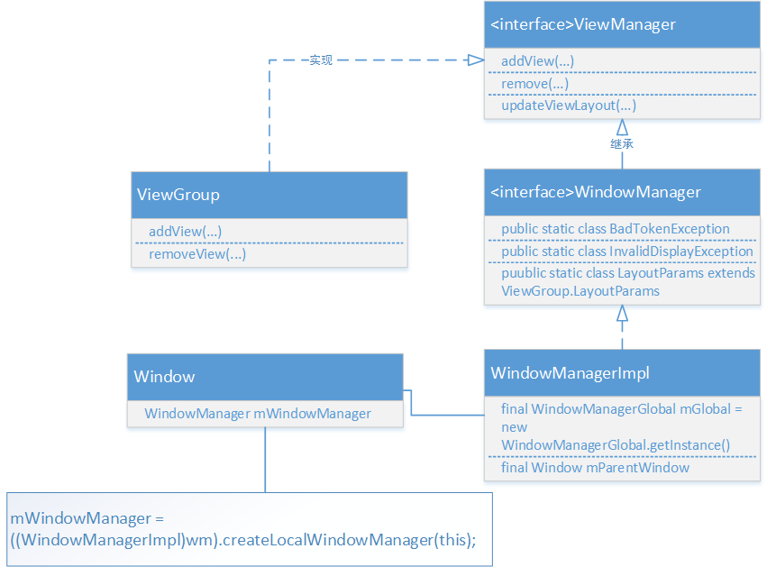
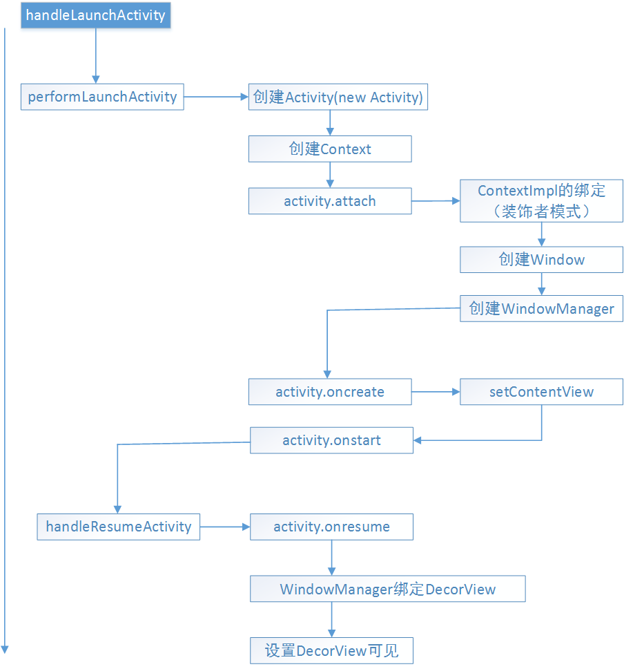

讲到Window大家肯定会想到常见的WindowManager，两者肯定是发生过关系的。此外对于Window和WindowManager的创建问题，正是下面要介绍的。了解他们前，我们先来看个结构



# ViewManager
---
```java
/** Interface to let you add and remove child views to an Activity. To get an instance
  * of this class, call {@link android.content.Context#getSystemService(java.lang.String) Context.getSystemService()}.
  */
public interface ViewManager
{
    public void addView(View view, ViewGroup.LayoutParams params);
    public void updateViewLayout(View view, ViewGroup.LayoutParams params);
    public void removeView(View view);
}
```
ViewManager接口定义了一组规则，也就是add、update、remove的操作View接口。也就是说ViewManager是用来添加和移除activity中View的接口，可以通过Context.getSystemService（）获取实例。
我们看下ViewManager的实现类
```java
public abstract class ViewGroup extends View implements ViewParent, ViewManager {
    private static final String TAG = "ViewGroup";
    ...
    public void addView(View child, LayoutParams params) {
        addView(child, -1, params);
    }
    
     /*
     * @param child the child view to add
     * @param index the position at which to add the child or -1 to add last
     * @param params the layout parameters to set on the child
     */
    public void addView(View child, int index, LayoutParams params) {
        // addViewInner() will call child.requestLayout() when setting the new LayoutParams
        // therefore, we call requestLayout() on ourselves before, so that the child's request
        // will be blocked at our level
        requestLayout();
        invalidate(true);
        addViewInner(child, index, params, false);
    }
    ...
```
可以看到ViewGroup里面实现了ViewManager接口，View通过ViewGroup的addView方法添加到ViewGroup中，而ViewGroup层层嵌套到最顶级都会显示在在一个窗口Window中

# WindowManager
---
```java
/*   The interface that apps use to talk to the window manager.
Use Context.getSystemService(Context.WINDOW_SERVICE) to get one of these.
*/
public interface WindowManager extends ViewManager {
    public static class BadTokenException extends RuntimeException{...}
    public static class InvalidDisplayException extends RuntimeException{...}
    public Display getDefaultDisplay()；
    public void removeViewImmediate(View view);
    public static class LayoutParams extends ViewGroup.LayoutParams
        implements Parcelable
```
可以看到WindowManager是一个接口，而且它继承与ViewManager。WindowManager字面理解就是窗口管理器，每一个窗口管理器都与一个的窗口显示绑定。获取实例可以通过
`Context.getSystemService(Context.WINDOW_SERVICE)`获取。既然继承了ViewManager，那么它也就可以进行添加删除View的操作了，不过它的操作放在它的实现类WindowManagerImpl里面。成员变量里面

* BadTokenException：则是addView时它的LayoutParams无效则会被抛出，或是添加第二个View的时候没有移除第一个View则会被抛出
* InvalidDisplayException：如果一个窗口是在一个二级的显示上而指定的显示找不到则会被抛出
* getDefaultDisplay：返回当前WindowManager管理的显示Display
* removeViewImmediate：表示从窗口上移除View，一般是当View调用了onDetachedFromWindow也就是从Window上分开后，把它移除。
* LayoutParams：静态内部类。显然是Window的布局参数，里面定义了一系列的窗口属性。

# WindowManagerImpl WindowManager的实现类
---
```java
public final class WindowManagerImpl implements WindowManager {
    private final WindowManagerGlobal mGlobal = WindowManagerGlobal.getInstance();
    private final Display mDisplay;
    private final Window mParentWindow;
     @Override
    public void addView(@NonNull View view, @NonNull ViewGroup.LayoutParams params) {
        applyDefaultToken(params);
        mGlobal.addView(view, params, mDisplay, mParentWindow);
    }
    ...
     @Override
    public void removeView(View view) {
        mGlobal.removeView(view, false);
    }
}
```
可以看到WindowManagerImpl里面有一个成员变量WindowManagerGlobal，而真正的实现则是在WindowManagerGlobal了，类似代理，只不过WindowManagerGlobal是个没有实现WindowManager的类的，自己定义了套实现。
```java
public final class WindowManagerGlobal {
    private static final String TAG = "WindowManager";
     public void addView(View view, ViewGroup.LayoutParams params,
            Display display, Window parentWindow) {
            ...
     }
}
```
# 联系
---
大概了解了上述类的分类和各自的作用，那么他们之间如何联系，Window如何创建如何与WindowManager绑定与Activity绑定呢，这个时候就需要一个场景来逐一理解。我们都知道每一个Activity都是与一个Window绑定一起的，那么Window的创建以及WindowManager的绑定会不会在创建启动Activity的过程中就绑定的呢。

对于Activity的启动过程，是有两种，一种是点击程序进入启动的Activity，另一种而是在已有的Activity中调用startActivity，启动期间通过Binder驱动ActivityWindowService，ActivityThread,ApplicationThread，ActivityStack ，Activity之间进行通信，为当前Activity创建进程分配任务栈后启动Activity。这里就跳过前面很多步骤，直接到了ActivityThread.handleLaunchActivity去查看Activity的创建
```java
private void handleLaunchActivity(ActivityClientRecord r, Intent customIntent) {
    ...

    // Initialize before creating the activity
    WindowManagerGlobal.initialize();

    Activity a = performLaunchActivity(r, customIntent);

    if (a != null) {
        r.createdConfig = new Configuration(mConfiguration);
        Bundle oldState = r.state;
        handleResumeActivity(r.token, false, r.isForward,
        ...
}
```
可以看到 WindowManagerGlobal.initialize()则通过WindowManagerGlobal创建了WindowManagerServer，接下来调用了performLaunchActivity
```java
private Activity performLaunchActivity(ActivityClientRecord r, Intent customIntent) {
    ...
    Activity activity = null;
    try { //Activity通过ClassLoader创建出来
        java.lang.ClassLoader cl = r.packageInfo.getClassLoader();
        activity = mInstrumentation.newActivity(
                cl, component.getClassName(), r.intent);  
    } ...
    try {
        //创建Application
        Application app = r.packageInfo.makeApplication(false, mInstrumentation);
        ...
        if (activity != null) {
            //创建Activity所需的Context
            Context appContext = createBaseContextForActivity(r, activity);
            ...
            //将Context与Activity进行绑定
            activity.attach(appContext, this, getInstrumentation(), r.token,
                    r.ident, app, r.intent, r.activityInfo, title, r.parent,
                    r.embeddedID, r.lastNonConfigurationInstances, config,
                    r.referrer, r.voiceInteractor);
            ...
                //调用activity.oncreate
                mInstrumentation.callActivityOnCreate(activity, r.state, r.persistentState);
            ...
                    //调用Activity的onstart方法
                    activity.performStart();
                        //调用activitu的OnRestoreInstanceState方法进行Window数据恢复 
            mInstrumentation.callActivityOnRestoreInstanceState(activity, r.state,
                                r.persistentState);
            ...
    return activity;
}
```
先通过调用 activity = mInstrumentation.newActivity创建Activity，可以看到里面是通过ClassLoader来加载的
```java
public Activity newActivity(ClassLoader cl, String className,
        Intent intent)
        throws InstantiationException, IllegalAccessException,
        ClassNotFoundException {
    return (Activity)cl.loadClass(className).newInstance();
}
```
接着创建Activity所需的Application和Context，再调用到activity.attach
```java
final void attach(Context context, ActivityThread aThread,
        Instrumentation instr, IBinder token, int ident,
        Application application, Intent intent, ActivityInfo info,
        CharSequence title, Activity parent, String id,
        NonConfigurationInstances lastNonConfigurationInstances,
        Configuration config, String referrer, IVoiceInteractor voiceInteractor) {
    //ContextImpl的绑定
    attachBaseContext(context);
    //在当前Activity创建Window
    mWindow = new PhoneWindow(this);
    mWindow.setCallback(this);
    mWindow.setOnWindowDismissedCallback(this);
    mWindow.getLayoutInflater().setPrivateFactory(this);
    ...
    //为Window设置WindowManager
    mWindow.setWindowManager(
            (WindowManager)context.getSystemService(Context.WINDOW_SERVICE),
            mToken, mComponent.flattenToString(),
            (info.flags & ActivityInfo.FLAG_HARDWARE_ACCELERATED) != 0);
    if (mParent != null) {
        mWindow.setContainer(mParent.getWindow());
    }
    //创建完后通过getWindowManager就可以得到WindowManager实例
    mWindowManager = mWindow.getWindowManager();
    mCurrentConfig = config;
}
```
可以看到在Activity创建到attach的时候，对应的Window窗口也被创建起来，而且Window也与WindowManager绑定。而mWindow，和mWindowManager则是Activity的成员变量。可以看到这里WindiwManager的创建是context.getSystemService(Context.WINDOW_SERVICE)
```java
public void setWindowManager(WindowManager wm, IBinder appToken, String appName,
        boolean hardwareAccelerated) {
    ...
    if (wm == null) {
        wm = (WindowManager)mContext.getSystemService(Context.WINDOW_SERVICE);
    }
    mWindowManager = ((WindowManagerImpl)wm).createLocalWindowManager(this);
}
```
接着创建WindowManager的实现类，我们平时在Activity中使用getWindow（）和getWindowManager，就是返回对应这两个成员变量。

回到前面那个方法，调用了activity.attach后创建了Window和WindowManager，之后调用了
```java
mInstrumentation.callActivityOnCreate(activity, r.state ...);
```
该方法则是调用activity.oncreate方法的
```java
public void callActivityOnCreate(Activity activity, Bundle icicle) {
    prePerformCreate(activity);
    activity.performCreate(icicle);
    postPerformCreate(activity);
}
```
```java
final void performCreate(Bundle icicle) {
    onCreate(icicle);
    mActivityTransitionState.readState(icicle);
    performCreateCommon();
}
```
之后直接调用了
```java
activity.performStart();
```
来调用activity.onstart()方法
同样之后也调用了
```java
mInstrumentation.callActivityOnRestoreInstanceState(activity, r.state...);
```
看到onRestoreInstanceState是不是很熟悉，没错就是Activity数据恢复调用的方法
```java
public void callActivityOnRestoreInstanceState(Activity activity, Bundle savedInstanceState) {
    activity.performRestoreInstanceState(savedInstanceState);
}
```
```java
final void performRestoreInstanceState(Bundle savedInstanceState) {
    onRestoreInstanceState(savedInstanceState);
    restoreManagedDialogs(savedInstanceState);
}
```
里面通过Bundle来保存恢复Window窗口信息
performLaunchActivity调用完后回到handleLaunchActivity
```java
private void handleLaunchActivity(ActivityClientRecord r, Intent customIntent) {
    ...

    //初始化WindowManagerGlobal，为之后addView准备
    WindowManagerGlobal.initialize();

    Activity a = performLaunchActivity(r, customIntent);

    if (a != null) {
        r.createdConfig = new Configuration(mConfiguration);
        Bundle oldState = r.state;
        handleResumeActivity(r.token, false, r.isForward,
        ...
}
```
调用了performLauncherActiviy来创建Activity以及Activity所需要的Context,Window，调用了Activity的onCreate,onStart方法，而接下来调用了handleResumeActivity方法
```java
final void handleResumeActivity(IBinder token,
        boolean clearHide, boolean isForward, boolean reallyResume) {

    //调用activity.onResume，把activity数据记录更新到ActivityClientRecord
    ActivityClientRecord r = performResumeActivity(token, clearHide);

    if (r != null) {
        final Activity a = r.activity;
        //activity.mStartedActivity是用来标记启动Activity，有没有带返回值，一般我们startActivity(intent)是否默认是startActivityForResult(intent,-1)，默认值是-1，所以这里mStartedActivity = false
        boolean willBeVisible = !a.mStartedActivity;
        ...
        //mFinished标记Activity有没有结束，而r.window一开始activity并未赋值给ActivityClientRecord，所以这里为null
        if (r.window == null && !a.mFinished && willBeVisible) {
            r.window = r.activity.getWindow(); //赋值
            View decor = r.window.getDecorView();
            decor.setVisibility(View.INVISIBLE);
            ViewManager wm = a.getWindowManager();
            WindowManager.LayoutParams l = r.window.getAttributes();
            a.mDecor = decor;
            l.type = WindowManager.LayoutParams.TYPE_BASE_APPLICATION;
            l.softInputMode |= forwardBit;
            if (a.mVisibleFromClient) {
                a.mWindowAdded = true;
                //把当前的DecorView与WindowManager绑定一起
                wm.addView(decor, l);
            }

        ...
        if (!r.activity.mFinished && willBeVisible
                && r.activity.mDecor != null && !r.hideForNow) {
            //标记当前的Activity有没有设置新的配置参数，比如现在手机是横屏的，而之后你转成竖屏，那么这里的newCofig就会被赋值，表示参数改变
            if (r.newConfig != null) {
                r.tmpConfig.setTo(r.newConfig);
                if (r.overrideConfig != null) {
                    r.tmpConfig.updateFrom(r.overrideConfig);
                }
                //然后调用这个方法回调，表示屏幕参数发生了改变
                performConfigurationChanged(r.activity, r.tmpConfig);
            ...
            WindowManager.LayoutParams l = r.window.getAttributes();
            ...//改变之后update更新当前窗口的DecorView
                if (r.activity.mVisibleFromClient) {
                    ViewManager wm = a.getWindowManager();
                    View decor = r.window.getDecorView();
                    wm.updateViewLayout(decor, l);
                }
            }
            //参数没改变
            r.activity.mVisibleFromServer = true;
            mNumVisibleActivities++;
            if (r.activity.mVisibleFromClient) {
            //由于前面设置了INVASIBLE，所以现在要把DecorView显示出来了
                r.activity.makeVisible();
            }
        }

        //通知ActivityManagerService，Activity完成Resumed
            ActivityManagerNative.getDefault().activityResumed(token);       
}
```
handleResumeActivity方法一开始就调用了activity = performResumeActivity（）方法
```java
public final ActivityClientRecord performResumeActivity(IBinder token,
        boolean clearHide) {
    ActivityClientRecord r = mActivities.get(token);
    ...
            r.activity.mStartedActivity = false;
            r.activity.onStateNotSaved();
            r.activity.mFragments.noteStateNotSaved();
    ...    //Activity调用onResume，就不再贴出来了，里面还有判断要不呀奥onReStart，这个想必知道Activity生命周期的人就秒懂了
            r.activity.performResume();
    ...
            r.paused = false;
            r.stopped = false;
            r.state = null;
            r.persistentState = null;
        
    return r;
}
```
performResumeActivity则是让Activity调用onResume方法，同时把Activity的信息记录在ActivityClientRecord
之后进入到这里这个判断方法。前面代码注释也有说到一些，这里再说详细一点。
```java
boolean willBeVisible = !a.mStartedActivity;
if (r.window == null && !a.mFinished && willBeVisible) {
    r.window = r.activity.getWindow(); //赋值
    View decor = r.window.getDecorView();
    decor.setVisibility(View.INVISIBLE);
    ViewManager wm = a.getWindowManager();
    WindowManager.LayoutParams l = r.window.getAttributes();
    a.mDecor = decor;
    l.type = WindowManager.LayoutParams.TYPE_BASE_APPLICATION;
    l.softInputMode |= forwardBit;
    if (a.mVisibleFromClient) {
        a.mWindowAdded = true;
        //把当前的DecorView与WindowManager绑定一起
        wm.addView(decor, l);
    }
```
r.window一开始null的，activity并没有把它的window赋值给它
a.finished表示Activity是否结束
activity.mStartedActivity是用来标记启动Activity需不需要带返回值，一般我们startActivity(intent)是否默认是startActivityForResult(intent,-1)，默认值是-1，所以这里mStartedActivity = false
```java
if (requestCode >= 0) {
    mStartedActivity = true;
}
```
接着获取当前Activity的Window进而获取到DecorView，再获取当前Activity的WindowManager，将DecorView与WindowManager绑定一起。
# 注意：
---
这里的DecorView是setContentView之后的DecorView，也就是装载我们的布局内容的。前面讲到在handleLaucheActivity中，它会先调用performLaunchActivity，再调用handleResumeActivity方法，而在performLaunchActivity方法中先创建Activity对象，接着调用activity.attach方法，来绑定Context，同时在attach中创建了PhoneWindow以及WindowManager，attach之后，就调用了activity.oncreate方法，要知道，我们的setContentView是放在onCreate方法中的。有看过上一篇setContentView的源码这里应该就会懂。DecorView是PhoneWindow的成员变量，所以setContentView可以说是将DecorView创建添加到Window上面的，调用setContentView后已经是把你的布局文件添加到DecorView了。
回到前面，因为是onCreate之后的，所以这里调用
```java
View decor = r.window.getDecorView();
```
便可以得到当前Activity.Window下的DecorView，接下来通过创建好的WindowManager将DecorView与它绑定到一起.

之后到了newConfig参数这里，前面注释已经解释很清楚
```java
if (!r.activity.mFinished && willBeVisible
        && r.activity.mDecor != null && !r.hideForNow) {
    //标记当前的Activity有没有设置新的配置参数，比如现在手机是横屏的，而之后你转成竖屏，那么这里的newCofig就会被赋值，表示参数改变
    if (r.newConfig != null) {
        r.tmpConfig.setTo(r.newConfig);
        if (r.overrideConfig != null) {
            r.tmpConfig.updateFrom(r.overrideConfig);
        }
        //然后调用这个方法回调，表示屏幕参数发生了改变
        performConfigurationChanged(r.activity, r.tmpConfig);
    ...
    WindowManager.LayoutParams l = r.window.getAttributes();
    ...//改变之后update更新当前窗口的DecorView
        if (r.activity.mVisibleFromClient) {
            ViewManager wm = a.getWindowManager();
            View decor = r.window.getDecorView();
            wm.updateViewLayout(decor, l);
        }
    }
```
这里我们看下performConfigurationChanged，可以先大胆猜测下这个方法肯定是来通知Activity参数改变的一个方法
```java
private static void performConfigurationChanged(ComponentCallbacks2 cb, Configuration config) {
    
    Activity activity = (cb instanceof Activity) ? (Activity) cb : null;
    if (shouldChangeConfig) {
        cb.onConfigurationChanged(config);
            ...
    }
}
```
果然，这里调用到了一个接口回调，注意ComponentCallbacks2这个参数，看它传进来的参数，是r.activity，也就是说Activity里面应该是实现了这个接口，接着通过回调去通知参数更改
```java
public class Activity extends ContextThemeWrapper
        implements LayoutInflater.Factory2,
        Window.Callback, KeyEvent.Callback,
        OnCreateContextMenuListener, ComponentCallbacks2,
Window.OnWindowDismissedCallback {...}
```
果然如此。
之后来到了最后一步，handleResumeActivity方法里的最后
```java
if (r.activity.mVisibleFromClient) {
//由于前面设置了INVASIBLE，所以现在要把DecorView显示出来了
    r.activity.makeVisible();
}
```
要知道，前面我们的DecorView可是设置了invisible(不知道是不是为了防止更新闪烁的问题)，之后可能是要把它设置回来，就是在makevisible方法中
```java
void makeVisible() {
    if (!mWindowAdded) {
        ViewManager wm = getWindowManager();
        wm.addView(mDecor, getWindow().getAttributes());
        mWindowAdded = true;
    }
    mDecor.setVisibility(View.VISIBLE);
}
```
可以看到如果当前DecorView还未添加到WindwManager的话，则重新添加，最后设置为VISIBLE。
而我们平常在activity中使用setVisibility，也就是在设置DecorView是VISIBLE还是INVASIBLE
```java
public void setVisible(boolean visible) {
    if (mVisibleFromClient != visible) {
        mVisibleFromClient = visible;
        if (mVisibleFromServer) {
            if (visible) makeVisible();
            else mDecor.setVisibility(View.INVISIBLE);
        }
    }
}
```
至此，Activity被启动起来，视图（DecorView）也被创建(Window)管理(WindowManager)起来了。

# 小结
---
上面把DecorView添加到WindowManager，调用到的是WindowManagerGlobal.addView方法，而该方法中真正把View传递给WindowManager的是通过ViewRoot的setView()方法，ViewRoot实现了View和WindowManager之间的消息传递。
* 一个流程图总结上面流程



* ViewManager接口定义了一组规则，也就是add、update、remove的操作View接口。ViewGroup实现了该接口
* WindowManager的实现类是WindowManagerImpl，而它则是通过WindowManagerGlobal代理实现。WindowManager用来在应用与Window之间的接口、窗口顺序、消息等的管理

