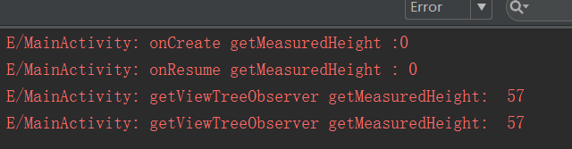
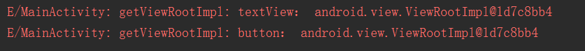

WindowManager的实现类是WindowManagerImpl，而它则是通过WindowManagerGlobal代理实现addView的，我们看下addView的方法

```java
public void addView(View view, ViewGroup.LayoutParams params,
        Display display, Window parentWindow) {
    ...
    ViewRootImpl root;
    View panelParentView = null;
    
    ...
        
    root = new ViewRootImpl(view.getContext(), display);
    view.setLayoutParams(wparams);
    mViews.add(view);
    mRoots.add(root);
    mParams.add(wparams);
    //ViewRootImpl开始绘制view
    root.setView(view, wparams, panelParentView);
    ...
}
```

可以看到在WindowManagerGlobal的addView中，最后是调用了ViewRootImpl的setView方法，那么这个ViewRootImpl到底是什么。

# ViewRootImpl
---
看到ViewRootImpl想到可能会有ViewRoot类，但是看了源码才知道，ViewRoot类在Android2.2之后就被ViewRootImpl替换了。我们看下说明
```java
/* The top of a view hierarchy, implementing the needed protocol between View
 * and the WindowManager.  This is for the most part an internal implementation
 * detail of {@link WindowManagerGlobal}.
 */
```
ViewRootImpl是一个视图层次结构的顶部，它实现了View与WindowManager之间所需要的协议，作为WindowManagerGlobal中大部分的内部实现。这个好理解，在WindowManagerGlobal中实现方法中，都可以见到ViewRootImpl，也就说WindowManagerGlobal方法最后还是调用到了ViewRootImpl。addView,removeView,update调用顺序
WindowManagerImpl -> WindowManagerGlobal -> ViewRootImpl

我们看下前面调用到了viewRootImpl的setView方法
```java
public void setView(View view, WindowManager.LayoutParams attrs, View panelParentView) {
    ...
    // Schedule the first layout -before- adding to the window  
    // manager, to make sure we do the relayout before receiving  
    // any other events from the system.
    requestLayout();
    ...
    try {
    ...
        res = mWindowSession.addToDisplay(mWindow, mSeq, mWindowAttributes,
                getHostVisibility(), mDisplay.getDisplayId(),
                mAttachInfo.mContentInsets, mAttachInfo.mStableInsets,
                mAttachInfo.mOutsets, mInputChannel);
    } 
}
```
在setView方法中，
首先会调用到requestLayout（），表示添加Window之前先完成第一次layout布局过程，以确保在收到任何系统事件后面重新布局。requestLayout最终会调用performTraversals方法来完成View的绘制。

接着会通过WindowSession最终来完成Window的添加过程。在下面的代码中mWindowSession类型是IWindowSession，它是一个Binder对象，真正的实现类是Session，也就是说这其实是一次IPC过程，远程调用了Session中的addToDisPlay方法。
```java
@Override
public int addToDisplay(IWindow window, int seq, WindowManager.LayoutParams attrs,
        int viewVisibility, int displayId, Rect outContentInsets, Rect outStableInsets,
        Rect outOutsets, InputChannel outInputChannel) {
    return mService.addWindow(this, window, seq, attrs, viewVisibility, displayId,
            outContentInsets, outStableInsets, outOutsets, outInputChannel);
}
```
这里的mService就是WindowManagerService，也就是说Window的添加请求，最终是通过WindowManagerService来添加的。

# View通过ViewRootImpl来绘制
---
前面说到，ViewRootImpl调用到requestLayout()来完成View的绘制操作，我们看下源码
```java
@Override
public void requestLayout() {
    if (!mHandlingLayoutInLayoutRequest) {
        checkThread();
        mLayoutRequested = true;
        scheduleTraversals();
    }
}
```
View绘制，先判断当前线程
```java
void checkThread() {
    if (mThread != Thread.currentThread()) {
        throw new CalledFromWrongThreadException(
                "Only the original thread that created a view hierarchy can touch its views.");
    }
}
```
如果不是当前线程则抛出异常，这个异常是不是感觉很熟悉啊。没错，当你在子线程更新UI没使用handler的话就会抛出这个异常

android.view.ViewRootImpl$CalledFromWrongThreadException: Only the original thread that created a view hierarchy can touch its views.
抛出地方就是这里，一般在子线程操作UI都会调用到view.invalidate，而View的重绘会触发ViewRootImpl的requestLayout，就会去判断当前线程。

接着看，判断完线程后，接着调用scheduleTraversals（）
```java
void scheduleTraversals() {
    if (!mTraversalScheduled) {
        ...
        mChoreographer.postCallback(
                Choreographer.CALLBACK_TRAVERSAL, mTraversalRunnable, null);
        ...
    }
}
```
scheduleTraversals中会通过handler去异步调用mTraversalRunnable接口
```java
final class TraversalRunnable implements Runnable {
    @Override
    public void run() {
        doTraversal();
    }
}
```
接着
```java
void doTraversal() {
    ...
    performTraversals();
    ...
}
```
可以看到，最后真正调用绘制的是performTraversals（）方法，这个方法很长核心便是
```java
private void performTraversals() {  
    ......  
    performMeasure(childWidthMeasureSpec, childHeightMeasureSpec);
    ...
    performLayout(lp, desiredWindowWidth, desiredWindowHeight);
    ......  
    performDraw();
    }
    ......  
}
```
而这个方法各自最终调用到的便是
```java
......  
int childWidthMeasureSpec = getRootMeasureSpec(mWidth, lp.width);  
int childHeightMeasureSpec = getRootMeasureSpec(mHeight, lp.height);  
....
mView.measure(childWidthMeasureSpec, childHeightMeasureSpec);  
......  
mView.layout(0, 0, mView.getMeasuredWidth(), mView.getMeasuredHeight());  
......  
mView.draw(canvas);  
```
会开始触发测量绘制。
performTraversals方法会经过measure、layout和draw三个过程才能将一个View绘制出来，所以View的绘制是ViewRootImpl完成的，另外当手动调用invalidate，postInvalidate，requestInvalidate也会最终调用performTraversals，来重新绘制View。

# View与WindowManager联系
---
那么View和WindowManager之间是怎么通过ViewRootImpl联系的呢。

从第三篇文章中我们知道，WindowManager是继承于ViewManager接口的，而ViewManager提供了添加View，删除View，更新View的方法。就拿setContentView来说，当Activity的onCreate调用到了setContentView后，view就会被绘制了吗？肯定不是，setContentView只是把需要添加的View的结构添加保存在DecorView中。此时的DecorView还并没有被绘制（没有触发view.measure,layout,draw）。

DecorView真正的绘制显示是在activity.handleResumeActivity方法中DecorView被添加到WindowManager时候，也就是调用到windowManager.addView(decorView)。而在windowManager.addView方法中调用到windowManagerGlobal.addView，开始创建初始化ViewRootImpl，再调用到viewRootImpl.setView，最后是调用到viewRootImpl的performTraversals来进行view的绘制（measure,layout,draw），这个时候View才真正被绘制出来。

这也就是为什么我们在onCreate方法中调用view.getMeasureHeight() = 0的原因，我们知道activity.handleResumeActivity最后调用到的是activity的onResume方法，但是按上面所说在onResume方法中调用就可以得到了吗，答案肯定是否定的，因为ViewRootImpl绘制View并非是同步的，而是异步（Handler）。

难道就没有得监听了吗？相信大家以前获取使用的大多是
```java
view.getViewTreeObserver().addOnGlobalLayoutListener(new OnGlobalLayoutListener() {
    @Override
    public void onGlobalLayout() {
    // TODO Auto-generated method stub
             
    }
});
```
没错，的确是这个，为什么呢，因为在viewRootImpl的performTraversals的绘制最后，调用了
```java
{
    if (triggerGlobalLayoutListener) {
        mAttachInfo.mRecomputeGlobalAttributes = false;
        mAttachInfo.mTreeObserver.dispatchOnGlobalLayout();
    }
    ...
    performDraw();
}
```
dispatchOnGlobalLayout会触发OnGlobalLayoutListener的onGlobalLayout()函数回调
但此时View并还没有绘制显示出来，只是先调用了measure和layout，但也可以得到它的宽高了。



另外，前面说到，ViewRootImpl在调用requestLayout准备绘制View的时候会先判断线程，这里我们前面分析了，但也只是分析了一点。
```java
@Override
public void requestLayout() {
    if (!mHandlingLayoutInLayoutRequest) {
        checkThread();
        mLayoutRequested = true;
        scheduleTraversals();
    }
}
```
为什么这么说呢？
先看Activity下这段代码
```java
@Override
protected void onCreate(Bundle savedInstanceState) {
    super.onCreate(savedInstanceState);
    setContentView(R.layout.activity_main);
    tv = (TextView) findViewById(R.id.tv);
    new Thread(new Runnable() {
        @Override
        public void run() {
            tv.setText("Hohohong Test");
        }
    }).start();
}
```
我是在onCreate里面的子线程去更新UI的，那么会报错吗？测试后你就会知道不会报错，如果你放置个Button点击再去调用的话则会弹出报错。为什么会这样？
答案就是跟ViewRootImpl的初始化有关，因为在onCreate的时候此时View还没被绘制出来，ViewRootImpl还未创建出来，它的创建是在activity.handleResumeActivity的调用到windowManager.addView(decorView)时候，如前面说的ViewRootImpl才被创建起来
```java
public void addView(View view, ViewGroup.LayoutParams params,
        Display display, Window parentWindow) {
    ...
    ViewRootImpl root;
    ...
        
    root = new ViewRootImpl(view.getContext(), display);
    view.setLayoutParams(wparams);
    mViews.add(view);
    //ViewRootImpl保存在一个集合List中
    mRoots.add(root);
    mParams.add(wparams);
    //ViewRootImpl开始绘制view
    root.setView(view, wparams, panelParentView);
    ...
}
```
此时创建完才会去判断线程。是不是有种让你豁然开朗的感觉！

# View与ViewRootImpl的绑定
---
另外View和ViewRootImpl是怎么绑定在一起的呢？通过view.getViewRootImpl可以获取到ViewRootImpl。
```java
public ViewRootImpl getViewRootImpl() {
    if (mAttachInfo != null) {
        return mAttachInfo.mViewRootImpl;
    }
    return null;
}
```
而这个AttachInfo则是View里面一个静态内部类，它的构造方法
```java
AttachInfo(IWindowSession session, IWindow window, Display display,
        ViewRootImpl viewRootImpl, Handler handler, Callbacks effectPlayer) {
    mSession = session;
    mWindow = window;
    mWindowToken = window.asBinder();
    mDisplay = display;
    mViewRootImpl = viewRootImpl;
    mHandler = handler;
    mRootCallbacks = effectPlayer;
}
```
可以看到viewRootImpl在它的构造方法里赋值了，那么这个方法肯定是在ViewRootImpl创建时创建的，而ViewRootImpl的创建是在调用WindowManagerGlobal.addView的时候
```java
root = new ViewRootImpl(view.getContext(), display);
```
而构造方法中
```java
public ViewRootImpl(Context context, Display display) {
    mContext = context;
    mWindowSession = WindowManagerGlobal.getWindowSession();
    ...
    mAttachInfo = new View.AttachInfo(mWindowSession, mWindow, display, this, mHandler, this);
    ...
}
```
可以看到View与ViewRootImpl绑定一起了。
之后就可以通过view.getViewRootImpl获取到，而在Window里面也可以获取到ViewRootImpl，因为Window里面有DecorView（这里说的Window都是讲它的实现类PhoneWindo），前三篇已经介绍过了，通过DecorView来获取到ViewRootImpl
```java
private ViewRootImpl getViewRootImpl() {
    if (mDecor != null) {
        ViewRootImpl viewRootImpl = mDecor.getViewRootImpl();
        if (viewRootImpl != null) {
            return viewRootImpl;
        }
    }
    throw new IllegalStateException("view not added");
}
```
另外，一个View会对应一个ViewRootImpl吗？我们做个测试，在一个布局中打印两个不同控件的ViewRootImpl的内存地址
```java
Log.e(TAG, "getViewRootImpl: textView： " + tv.getViewRootImpl() );
Log.e(TAG, "getViewRootImpl: button： " + btn.getViewRootImpl() );
```
结果



可以看到，都是同一个对象，共用一个ViewRootImpl。

# 小结
---
* 之所以说ViewRoot是View和WindowManager的桥梁，是因为在真正操控绘制View的是ViewRootImpl，View通过WindowManager来转接调用ViewRootImpl
* 在ViewRootImpl未初始化创建的时候是可以进行子线程更新UI的，而它创建是在activity.handleResumeActivity方法调用，即DecorView被添加到WindowManager的时候
* ViewRootImpl绘制View的时候会先检查当前线程是否是主线程，是才能继续绘制下去