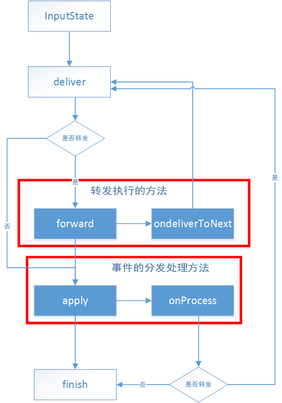
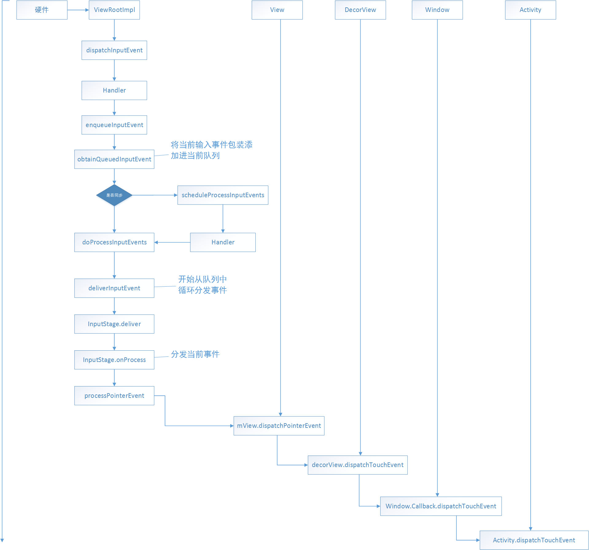

本篇文章最主要介绍ViewRootImpl的事件分发功能。当然，对于事件分发，大家肯定很熟悉，但是大家平常所看到的事件分发机制则是在Activity得到触摸事件后的，然后再传递给View处理，那么到底是谁传递给Activity触摸事件的呢？

# ViewRootImpl事件分发
---
前面只是介绍到了ViewRootImpl的绘制功能，当然，你在看ViewRootImpl源码的时候会看到很多很多Event之类的，没错ViewRootImpl也是有事件分发的。要知道，当用户点击屏幕产生一个触摸行为，这个触摸行为则是通过底层硬件来传递捕获，然后交给ViewRootImpl，接着将事件传递给DecorView，而DecorView再交给PhoneWindow，PhoneWindow再交给Activity，然后接下来就是我们常见的View事件分发了。

**`硬件 -> ViewRootImpl -> DecorView -> PhoneWindow -> Activity`**

我们从ViewRootImpl开始看下具体的事件分发过程
首先会到ViewRootImpl的dispatchInputEvent
```java
public void dispatchInputEvent(InputEvent event, InputEventReceiver receiver) {
    SomeArgs args = SomeArgs.obtain();
    args.arg1 = event;
    args.arg2 = receiver;
    Message msg = mHandler.obtainMessage(MSG_DISPATCH_INPUT_EVENT, args);
    msg.setAsynchronous(true);
    mHandler.sendMessage(msg);
}
```
这里有两个参数，InputEvent和InputEventReceiver

InputEvent：输入事件的基类，它有两个子类，分别是KeyEvent,MotionEvent对应键盘输入事件和屏幕触摸事件，这两个也是我们比较熟悉的了。

InputEventReceiver：为应用程序提供了一个低级的机制来接收输入事件。也就是用来接收输入事件的，然后交给ViewRootImpl的dispatchInputEvent去分发。

上面代码可以看到输入事件接收器通过Handler切换到UI线程中。
```java
final class ViewRootHandler extends Handler {
    ...
    @Override
    public void handleMessage(Message msg) {
        switch (msg.what) {
                ...
            case MSG_DISPATCH_INPUT_EVENT: {
                SomeArgs args = (SomeArgs)msg.obj;
                InputEvent event = (InputEvent)args.arg1;
                InputEventReceiver receiver = (InputEventReceiver)args.arg2;
                enqueueInputEvent(event, receiver, 0, true);
                args.recycle();
            } break;
            ...
        }
    }
```
转发到UI线程后，调用到enqueueInputEvent
```java
void enqueueInputEvent(InputEvent event,
        InputEventReceiver receiver, int flags, boolean processImmediately) {
    adjustInputEventForCompatibility(event);
    //将当前输入事件加入队列中排列等候执行
    QueuedInputEvent q = obtainQueuedInputEvent(event, receiver, flags);
    //输入事件添加进队列后，加入输入事件的默认尾部
    QueuedInputEvent last = mPendingInputEventTail;
    if (last == null) {
        mPendingInputEventHead = q;
        mPendingInputEventTail = q;
    } else {
        last.mNext = q;
        mPendingInputEventTail = q;
    }
    //队列计数
    mPendingInputEventCount += 1;
    ...
    //processImmediately则是判断是同步还是异步，前面我们在handler中调用的，因为是在UI线程，肯定是同步的，所以传递了参数是true，如果是异步，则调用到scheduleProcessInputEvents()
    if (processImmediately) {
        doProcessInputEvents();
    } else {
        scheduleProcessInputEvents();
    }
}
```
可以看到enqueueInputEvent将当前的输入事件加入队列中，QueuedInputEvent相当于一个链表,
可以看到里面成员变量有next，用来链接下一个成员
```java
private static final class QueuedInputEvent {
    ...
    public QueuedInputEvent mNext;
    public InputEvent mEvent;
    public InputEventReceiver mReceiver;
    ...
}
```
而obtainQueuedInputEvent则是为当前的输入事件构建一个链表结构，然后链接到之前队列的尾部
```java
private QueuedInputEvent obtainQueuedInputEvent(InputEvent event,
        InputEventReceiver receiver, int flags) {
    QueuedInputEvent q = mQueuedInputEventPool;
    if (q != null) {
        mQueuedInputEventPoolSize -= 1;
        mQueuedInputEventPool = q.mNext;
        q.mNext = null;
    } else {
        q = new QueuedInputEvent();
    }

    q.mEvent = event;
    q.mReceiver = receiver;
    q.mFlags = flags;
    return q;
}
```
接着到了
```java
if (processImmediately) {
    doProcessInputEvents();
} else {
    scheduleProcessInputEvents();
}
```
processImmediately则是判断是同步还是异步，前面我们在handler中调用的，因为是在UI线程，肯定是同步的，所以传递了参数是true，如果是异步，则调用到scheduleProcessInputEvents()
```java
private void scheduleProcessInputEvents() {
    if (!mProcessInputEventsScheduled) {
        mProcessInputEventsScheduled = true;
        Message msg = mHandler.obtainMessage(MSG_PROCESS_INPUT_EVENTS);
        msg.setAsynchronous(true);
        mHandler.sendMessage(msg);
    }
}
```
Handler中
```java
case MSG_PROCESS_INPUT_EVENTS:
            mProcessInputEventsScheduled = false;
            doProcessInputEvents();
            break;
```
可以看到最后还是调用到了doProcessInputEvents。
```java
void doProcessInputEvents() {
    //循环取出队列中的输入事件
    while (mPendingInputEventHead != null) {
        QueuedInputEvent q = mPendingInputEventHead;
        mPendingInputEventHead = q.mNext;
        ...
        mPendingInputEventCount -= 1;
        ...
        //分发处理
        deliverInputEvent(q);
    }

    //处理完所有输入事件，清楚标志
    if (mProcessInputEventsScheduled) {
        mProcessInputEventsScheduled = false;
        mHandler.removeMessages(MSG_PROCESS_INPUT_EVENTS);
    }
}
```
可以看到该方法是用来循环获取队列中的输入事件
接着进行分发处理deliverInputEvent(q)
```java
private void deliverInputEvent(QueuedInputEvent q) {
    //校验输入事件
    if (mInputEventConsistencyVerifier != null) {
        mInputEventConsistencyVerifier.onInputEvent(q.mEvent, 0);
    }

    InputStage stage;
    if (q.shouldSendToSynthesizer()) {
        stage = mSyntheticInputStage;
    } else {
        stage = q.shouldSkipIme() ? mFirstPostImeInputStage : mFirstInputStage;
    }

    if (stage != null) {
        stage.deliver(q);
    } else {
        finishInputEvent(q);
    }
}
```
这里InputStage则是一个实现处理输入事件责任的阶段，它是一个基类，也就是说InputStage提供一系列处理输入事件的方法，也可以转发给其他事件处理，而具体的处理则是看它的实现类。每种InputStage可以处理一定的事件类型，比如AsyncInputStage、ViewPreImeInputStage、ViewPostImeInputStage等。当一个InputEvent到来时，ViewRootImpl会寻找合适它的InputStage来处理。
InputStage的处理情况为，会先调用deliver开始处理



最终的事件分发处理则是在apply方法里的onProcess方法。

对于点击事件来说，InputState的子类ViewPostImeInputStage可以处理它，我们看下ViewPostImeInputStage的onProcess
```java
@Override
protected int onProcess(QueuedInputEvent q) {
    if (q.mEvent instanceof KeyEvent) {
        return processKeyEvent(q);
    } else {
        // If delivering a new non-key event, make sure the window is
        // now allowed to start updating.
        handleDispatchWindowAnimationStopped();
        final int source = q.mEvent.getSource();
        if ((source & InputDevice.SOURCE_CLASS_POINTER) != 0) {
            return processPointerEvent(q);
        } else if ((source & InputDevice.SOURCE_CLASS_TRACKBALL) != 0) {
            return processTrackballEvent(q);
        } else {
            return processGenericMotionEvent(q);
        }
    }
}
```
在ViewPostImeInputStage里面有判断是键盘事件还是触摸事件，这里我们只看触摸事件，调用到了
processPointerEvent（q）方法
```java
private int processPointerEvent(QueuedInputEvent q) {
    final MotionEvent event = (MotionEvent)q.mEvent;

    mAttachInfo.mUnbufferedDispatchRequested = false;
    boolean handled = mView.dispatchPointerEvent(event);
    ...
    return handled ? FINISH_HANDLED : FORWARD;
}
```
而这里调用到了mView.dispatchPointerEvent，这里的mView就是DecorView，细心的话可能就知道mView是在setView的时候赋值的
```java
public void setView(View view, WindowManager.LayoutParams attrs, View panelParentView) {
    synchronized (this) {
        if (mView == null) {
            mView = view;
            ...
    }
}
```
再看View的dispatchPointerEvent
```java
public final boolean dispatchPointerEvent(MotionEvent event) {
    if (event.isTouchEvent()) {
        return dispatchTouchEvent(event);
    } else {
        return dispatchGenericMotionEvent(event);
    }
}
```
可以看到，这里会再判断当前事件是否是触摸事件，如果是则调用了dispatchTouchEvent进行分发，
而我们的DecorView是继承于View的，根据多态，我们看下DecorView对dispatchTouchEvent的重写
```java
@Override
public boolean dispatchTouchEvent(MotionEvent ev) {
    final Callback cb = getCallback();
    return cb != null && !isDestroyed() && mFeatureId < 0 ? cb.dispatchTouchEvent(ev)
            : super.dispatchTouchEvent(ev);
}
```
可以看到，这里调用了callback.dispatchTouchEvent，Callback是Window里面的一个接口
```java
public interface Callback {
    ...
    public boolean dispatchKeyEvent(KeyEvent event);
    ...
    public boolean dispatchTouchEvent(MotionEvent event);
}
```
既然是callback调用了，那么到底是谁实现了Callback接口去调用的？
正是Activity
```java
public class Activity extends ContextThemeWrapper
        implements LayoutInflater.Factory2,
        Window.Callback, KeyEvent.Callback,
        OnCreateContextMenuListener, ComponentCallbacks2,
        Window.OnWindowDismissedCallback {
        ..
}
```
而在Activity的attach方法中
```java
final void attach(Context context, ActivityThread aThread,
        Instrumentation instr, IBinder token, int ident,
        Application application, Intent intent, ActivityInfo info,
        CharSequence title, Activity parent, String id,
        NonConfigurationInstances lastNonConfigurationInstances,
        Configuration config, String referrer, IVoiceInteractor voiceInteractor) {
    ...
    mWindow = new PhoneWindow(this);
    mWindow.setCallback(this);
    mWindow.setOnWindowDismissedCallback(this);
    mWindow.getLayoutInflater().setPrivateFactory(this);
}
```
PhoneWindow通过设置setCallback将Callback设置为this也就是Activity。到这里，点击事件就传到了Activity，之后的事件分发就是大家比较熟悉的了。

# 小结
---
ViewRootImpl事件分发流程图



