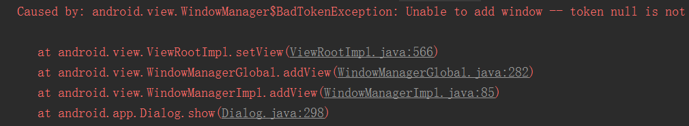

本篇文章就来介绍这两个的窗口机制以及WindowManager.LayoutParams和Token

# WindowManager.LayoutParams
---
首先，先跟大家介绍这个WindowManager.LayoutParams，在前面几篇文章中，都有出现过这个LayoutParams，我们看下具体的源码。

```java
public static class LayoutParams extends ViewGroup.LayoutParams
        implements Parcelable {
    //窗口的绝对XY位置，需要考虑gravity属性
    public int x;
    public int y;
    //在横纵方向上为相关的View预留多少扩展像素，如果是0则此view不能被拉伸，其他情况下扩展像素被widget均分
    public float horizontalWeight;
    public float verticalWeight;
    //窗口类型
    //有3种主要类型如下：
    //ApplicationWindows取值在FIRST_APPLICATION_WINDOW与LAST_APPLICATION_WINDOW之间，是常用的顶层应用程序窗口，须将token设置成Activity的token；
    //SubWindows取值在FIRST_SUB_WINDOW和LAST_SUB_WINDOW之间，与顶层窗口相关联，需将token设置成它所附着宿主窗口的token；
    //SystemWindows取值在FIRST_SYSTEM_WINDOW和LAST_SYSTEM_WINDOW之间，不能用于应用程序，使用时需要有特殊权限，它是特定的系统功能才能使用；
    public int type;

    //WindowType：开始应用程序窗口
    public static final int FIRST_APPLICATION_WINDOW = 1;
    //WindowType：所有程序窗口的base窗口，其他应用程序窗口都显示在它上面
    public static final int TYPE_BASE_APPLICATION   = 1;
    //WindowType：普通应用程序窗口，token必须设置为Activity的token来指定窗口属于谁
    public static final int TYPE_APPLICATION        = 2;
    //WindowType：应用程序启动时所显示的窗口，应用自己不要使用这种类型，它被系统用来显示一些信息，直到应用程序可以开启自己的窗口为止
    public static final int TYPE_APPLICATION_STARTING = 3;
    //WindowType：结束应用程序窗口
    public static final int LAST_APPLICATION_WINDOW = 99;

    //WindowType：SubWindows子窗口，子窗口的Z序和坐标空间都依赖于他们的宿主窗口
    public static final int FIRST_SUB_WINDOW        = 1000;
    //WindowType： 面板窗口，显示于宿主窗口的上层
    public static final int TYPE_APPLICATION_PANEL  = FIRST_SUB_WINDOW;
    //WindowType：媒体窗口（例如视频），显示于宿主窗口下层
    public static final int TYPE_APPLICATION_MEDIA  = FIRST_SUB_WINDOW+1;
    //WindowType：应用程序窗口的子面板，显示于所有面板窗口的上层
    public static final int TYPE_APPLICATION_SUB_PANEL = FIRST_SUB_WINDOW+2;
    //WindowType：对话框，类似于面板窗口，绘制类似于顶层窗口，而不是宿主的子窗口
    public static final int TYPE_APPLICATION_ATTACHED_DIALOG = FIRST_SUB_WINDOW+3;
    //WindowType：媒体信息，显示在媒体层和程序窗口之间，需要实现半透明效果
    public static final int TYPE_APPLICATION_MEDIA_OVERLAY  = FIRST_SUB_WINDOW+4;
    //WindowType：子窗口结束
    public static final int LAST_SUB_WINDOW         = 1999;

    //WindowType：系统窗口，非应用程序创建
    public static final int FIRST_SYSTEM_WINDOW     = 2000;
    //WindowType：状态栏，只能有一个状态栏，位于屏幕顶端，其他窗口都位于它下方
    public static final int TYPE_STATUS_BAR         = FIRST_SYSTEM_WINDOW;
    //WindowType：搜索栏，只能有一个搜索栏，位于屏幕上方
    public static final int TYPE_SEARCH_BAR         = FIRST_SYSTEM_WINDOW+1;
    //WindowType：电话窗口，它用于电话交互（特别是呼入），置于所有应用程序之上，状态栏之下
    public static final int TYPE_PHONE              = FIRST_SYSTEM_WINDOW+2;
    //WindowType：系统提示，出现在应用程序窗口之上
    public static final int TYPE_SYSTEM_ALERT       = FIRST_SYSTEM_WINDOW+3;
    //WindowType：锁屏窗口
    public static final int TYPE_KEYGUARD           = FIRST_SYSTEM_WINDOW+4;
    //WindowType：信息窗口，用于显示Toast
    public static final int TYPE_TOAST              = FIRST_SYSTEM_WINDOW+5;
    //WindowType：系统顶层窗口，显示在其他一切内容之上，此窗口不能获得输入焦点，否则影响锁屏
    public static final int TYPE_SYSTEM_OVERLAY     = FIRST_SYSTEM_WINDOW+6;
    //WindowType：电话优先，当锁屏时显示，此窗口不能获得输入焦点，否则影响锁屏
    public static final int TYPE_PRIORITY_PHONE     = FIRST_SYSTEM_WINDOW+7;
    //WindowType：系统对话框
    public static final int TYPE_SYSTEM_DIALOG      = FIRST_SYSTEM_WINDOW+8;
    //WindowType：锁屏时显示的对话框
    public static final int TYPE_KEYGUARD_DIALOG    = FIRST_SYSTEM_WINDOW+9;
    //WindowType：系统内部错误提示，显示于所有内容之上
    public static final int TYPE_SYSTEM_ERROR       = FIRST_SYSTEM_WINDOW+10;
    //WindowType：内部输入法窗口，显示于普通UI之上，应用程序可重新布局以免被此窗口覆盖
    public static final int TYPE_INPUT_METHOD       = FIRST_SYSTEM_WINDOW+11;
    //WindowType：内部输入法对话框，显示于当前输入法窗口之上
    public static final int TYPE_INPUT_METHOD_DIALOG= FIRST_SYSTEM_WINDOW+12;
    //WindowType：墙纸窗口
    public static final int TYPE_WALLPAPER          = FIRST_SYSTEM_WINDOW+13;
    //WindowType：状态栏的滑动面板
    public static final int TYPE_STATUS_BAR_PANEL   = FIRST_SYSTEM_WINDOW+14;
    //WindowType：安全系统覆盖窗口，这些窗户必须不带输入焦点，否则会干扰键盘
    public static final int TYPE_SECURE_SYSTEM_OVERLAY = FIRST_SYSTEM_WINDOW+15;
    //WindowType：拖放伪窗口，只有一个阻力层(最多)，它被放置在所有其他窗口上面
    public static final int TYPE_DRAG               = FIRST_SYSTEM_WINDOW+16;
    //WindowType：状态栏下拉面板
    public static final int TYPE_STATUS_BAR_SUB_PANEL = FIRST_SYSTEM_WINDOW+17;
    //WindowType：鼠标指针
    public static final int TYPE_POINTER = FIRST_SYSTEM_WINDOW+18;
    //WindowType：导航栏(有别于状态栏时)
    public static final int TYPE_NAVIGATION_BAR = FIRST_SYSTEM_WINDOW+19;
    //WindowType：音量级别的覆盖对话框，显示当用户更改系统音量大小
    public static final int TYPE_VOLUME_OVERLAY = FIRST_SYSTEM_WINDOW+20;
    //WindowType：起机进度框，在一切之上
    public static final int TYPE_BOOT_PROGRESS = FIRST_SYSTEM_WINDOW+21;
    //WindowType：假窗，消费导航栏隐藏时触摸事件
    public static final int TYPE_HIDDEN_NAV_CONSUMER = FIRST_SYSTEM_WINDOW+22;
    //WindowType：梦想(屏保)窗口，略高于键盘
    public static final int TYPE_DREAM = FIRST_SYSTEM_WINDOW+23;
    //WindowType：导航栏面板(不同于状态栏的导航栏)
    public static final int TYPE_NAVIGATION_BAR_PANEL = FIRST_SYSTEM_WINDOW+24;
    //WindowType：universe背后真正的窗户
    public static final int TYPE_UNIVERSE_BACKGROUND = FIRST_SYSTEM_WINDOW+25;
    //WindowType：显示窗口覆盖，用于模拟辅助显示设备
    public static final int TYPE_DISPLAY_OVERLAY = FIRST_SYSTEM_WINDOW+26;
    //WindowType：放大窗口覆盖，用于突出显示的放大部分可访问性放大时启用
    public static final int TYPE_MAGNIFICATION_OVERLAY = FIRST_SYSTEM_WINDOW+27;
    //WindowType：......
    public static final int TYPE_KEYGUARD_SCRIM           = FIRST_SYSTEM_WINDOW+29;
    public static final int TYPE_PRIVATE_PRESENTATION = FIRST_SYSTEM_WINDOW+30;
    public static final int TYPE_VOICE_INTERACTION = FIRST_SYSTEM_WINDOW+31;
    public static final int TYPE_ACCESSIBILITY_OVERLAY = FIRST_SYSTEM_WINDOW+32;
    //WindowType：系统窗口结束
    public static final int LAST_SYSTEM_WINDOW      = 2999;

    //MemoryType：窗口缓冲位于主内存
    public static final int MEMORY_TYPE_NORMAL = 0;
    //MemoryType：窗口缓冲位于可以被DMA访问，或者硬件加速的内存区域
    public static final int MEMORY_TYPE_HARDWARE = 1;
    //MemoryType：窗口缓冲位于可被图形加速器访问的区域
    public static final int MEMORY_TYPE_GPU = 2;
    //MemoryType：窗口缓冲不拥有自己的缓冲区，不能被锁定，缓冲区由本地方法提供
    public static final int MEMORY_TYPE_PUSH_BUFFERS = 3;

    //指出窗口所使用的内存缓冲类型，默认为NORMAL 
    public int memoryType;

    //Flag：当该window对用户可见的时候，允许锁屏
    public static final int FLAG_ALLOW_LOCK_WHILE_SCREEN_ON     = 0x00000001;
    //Flag：让该window后所有的东西都成暗淡
    public static final int FLAG_DIM_BEHIND        = 0x00000002;
    //Flag：让该window后所有东西都模糊（4.0以上已经放弃这种毛玻璃效果）
    public static final int FLAG_BLUR_BEHIND        = 0x00000004;
    //Flag：让window不能获得焦点，这样用户快就不能向该window发送按键事
    public static final int FLAG_NOT_FOCUSABLE      = 0x00000008;
    //Flag：让该window不接受触摸屏事件
    public static final int FLAG_NOT_TOUCHABLE      = 0x00000010;
    //Flag：即使在该window在可获得焦点情况下，依旧把该window之外的任何event发送到该window之后的其他window
    public static final int FLAG_NOT_TOUCH_MODAL    = 0x00000020;
    //Flag：当手机处于睡眠状态时，如果屏幕被按下，那么该window将第一个收到
    public static final int FLAG_TOUCHABLE_WHEN_WAKING = 0x00000040;
    //Flag：当该window对用户可见时，让设备屏幕处于高亮（bright）状态
    public static final int FLAG_KEEP_SCREEN_ON     = 0x00000080;
    //Flag：让window占满整个手机屏幕，不留任何边界
    public static final int FLAG_LAYOUT_IN_SCREEN   = 0x00000100;
    //Flag：window大小不再不受手机屏幕大小限制，即window可能超出屏幕之外
    public static final int FLAG_LAYOUT_NO_LIMITS   = 0x00000200;
    //Flag：window全屏显示
    public static final int FLAG_FULLSCREEN      = 0x00000400;
    //Flag：恢复window非全屏显示
    public static final int FLAG_FORCE_NOT_FULLSCREEN   = 0x00000800;
    //Flag：开启抖动（dithering）
    public static final int FLAG_DITHER             = 0x00001000;
    //Flag：当该window在进行显示的时候，不允许截屏
    public static final int FLAG_SECURE             = 0x00002000;
    //Flag：一个特殊模式的布局参数用于执行扩展表面合成时到屏幕上
    public static final int FLAG_SCALED             = 0x00004000;
    //Flag：用于windows时,经常会使用屏幕用户持有反对他们的脸,它将积极过滤事件流,以防止意外按在这种情况下,可能不需要为特定的窗口,在检测到这样一个事件流时,应用程序将接收取消运动事件表明,这样应用程序可以处理这相应地采取任何行动的事件,直到手指释放
    public static final int FLAG_IGNORE_CHEEK_PRESSES    = 0x00008000;
    //Flag：一个特殊的选项只用于结合FLAG_LAYOUT_IN_SC
    public static final int FLAG_LAYOUT_INSET_DECOR = 0x00010000;
    //Flag：转化的状态FLAG_NOT_FOCUSABLE对这个窗口当前如何进行交互的方法
    public static final int FLAG_ALT_FOCUSABLE_IM = 0x00020000;
    //Flag：如果你设置了该flag,那么在你FLAG_NOT_TOUNCH_MODAL的情况下，即使触摸屏事件发送在该window之外，其事件被发送到了后面的window,那么该window仍然将以MotionEvent.ACTION_OUTSIDE形式收到该触摸屏事件
    public static final int FLAG_WATCH_OUTSIDE_TOUCH = 0x00040000;
    //Flag：当锁屏的时候，显示该window
    public static final int FLAG_SHOW_WHEN_LOCKED = 0x00080000;
    //Flag：在该window后显示系统的墙纸
    public static final int FLAG_SHOW_WALLPAPER = 0x00100000;
    //Flag：当window被显示的时候，系统将把它当做一个用户活动事件，以点亮手机屏幕
    public static final int FLAG_TURN_SCREEN_ON = 0x00200000;
    //Flag：消失键盘
    public static final int FLAG_DISMISS_KEYGUARD = 0x00400000;
    //Flag：当该window在可以接受触摸屏情况下，让因在该window之外，而发送到后面的window的触摸屏可以支持split touch
    public static final int FLAG_SPLIT_TOUCH = 0x00800000;
    //Flag：对该window进行硬件加速，该flag必须在Activity或Dialog的Content View之前进行设置
    public static final int FLAG_HARDWARE_ACCELERATED = 0x01000000;
    //Flag：让window占满整个手机屏幕，不留任何边界
    public static final int FLAG_LAYOUT_IN_OVERSCAN = 0x02000000;
    //Flag：请求一个半透明的状态栏背景以最小的系统提供保护
    public static final int FLAG_TRANSLUCENT_STATUS = 0x04000000;
    //Flag：请求一个半透明的导航栏背景以最小的系统提供保护
    public static final int FLAG_TRANSLUCENT_NAVIGATION = 0x08000000;
    //Flag：......
    public static final int FLAG_LOCAL_FOCUS_MODE = 0x10000000;
    public static final int FLAG_SLIPPERY = 0x20000000;
    public static final int FLAG_LAYOUT_ATTACHED_IN_DECOR = 0x40000000;
    public static final int FLAG_DRAWS_SYSTEM_BAR_BACKGROUNDS = 0x80000000;

    //行为选项标记
    public int flags;

    //PrivateFlags：......
    public static final int PRIVATE_FLAG_FAKE_HARDWARE_ACCELERATED = 0x00000001;
    public static final int PRIVATE_FLAG_FORCE_HARDWARE_ACCELERATED = 0x00000002;
    public static final int PRIVATE_FLAG_WANTS_OFFSET_NOTIFICATIONS = 0x00000004;
    public static final int PRIVATE_FLAG_SHOW_FOR_ALL_USERS = 0x00000010;
    public static final int PRIVATE_FLAG_NO_MOVE_ANIMATION = 0x00000040;
    public static final int PRIVATE_FLAG_COMPATIBLE_WINDOW = 0x00000080;
    public static final int PRIVATE_FLAG_SYSTEM_ERROR = 0x00000100;
    public static final int PRIVATE_FLAG_INHERIT_TRANSLUCENT_DECOR = 0x00000200;
    public static final int PRIVATE_FLAG_KEYGUARD = 0x00000400;
    public static final int PRIVATE_FLAG_DISABLE_WALLPAPER_TOUCH_EVENTS = 0x00000800;

    //私有的行为选项标记
    public int privateFlags;

    public static final int NEEDS_MENU_UNSET = 0;
    public static final int NEEDS_MENU_SET_TRUE = 1;
    public static final int NEEDS_MENU_SET_FALSE = 2;
    public int needsMenuKey = NEEDS_MENU_UNSET;

    public static boolean mayUseInputMethod(int flags) {
        ......
    }

    //SOFT_INPUT：用于描述软键盘显示规则的bite的mask
    public static final int SOFT_INPUT_MASK_STATE = 0x0f;
    //SOFT_INPUT：没有软键盘显示的约定规则
    public static final int SOFT_INPUT_STATE_UNSPECIFIED = 0;
    //SOFT_INPUT：可见性状态softInputMode，请不要改变软输入区域的状态
    public static final int SOFT_INPUT_STATE_UNCHANGED = 1;
    //SOFT_INPUT：用户导航（navigate）到你的窗口时隐藏软键盘
    public static final int SOFT_INPUT_STATE_HIDDEN = 2;
    //SOFT_INPUT：总是隐藏软键盘
    public static final int SOFT_INPUT_STATE_ALWAYS_HIDDEN = 3;
    //SOFT_INPUT：用户导航（navigate）到你的窗口时显示软键盘
    public static final int SOFT_INPUT_STATE_VISIBLE = 4;
    //SOFT_INPUT：总是显示软键盘
    public static final int SOFT_INPUT_STATE_ALWAYS_VISIBLE = 5;
    //SOFT_INPUT：显示软键盘时用于表示window调整方式的bite的mask
    public static final int SOFT_INPUT_MASK_ADJUST = 0xf0;
    //SOFT_INPUT：不指定显示软件盘时，window的调整方式
    public static final int SOFT_INPUT_ADJUST_UNSPECIFIED = 0x00;
    //SOFT_INPUT：当显示软键盘时，调整window内的控件大小以便显示软键盘
    public static final int SOFT_INPUT_ADJUST_RESIZE = 0x10;
    //SOFT_INPUT：当显示软键盘时，调整window的空白区域来显示软键盘，即使调整空白区域，软键盘还是有可能遮挡一些有内容区域，这时用户就只有退出软键盘才能看到这些被遮挡区域并进行
    public static final int SOFT_INPUT_ADJUST_PAN = 0x20;
    //SOFT_INPUT：当显示软键盘时，不调整window的布局
    public static final int SOFT_INPUT_ADJUST_NOTHING = 0x30;
    //SOFT_INPUT：用户导航（navigate）到了你的window
    public static final int SOFT_INPUT_IS_FORWARD_NAVIGATION = 0x100;

    //软输入法模式选项
    public int softInputMode;

    //窗口如何停靠
    public int gravity;
    //水平边距，容器与widget之间的距离，占容器宽度的百分率
    public float horizontalMargin;
    //纵向边距
    public float verticalMargin;
    //积极的insets绘图表面和窗口之间的内容
    public final Rect surfaceInsets = new Rect();
    //期望的位图格式，默认为不透明，参考android.graphics.PixelFormat
    public int format;
    //窗口所使用的动画设置，它必须是一个系统资源而不是应用程序资源，因为窗口管理器不能访问应用程序
    public int windowAnimations;
    //整个窗口的半透明值，1.0表示不透明，0.0表示全透明
    public float alpha = 1.0f;
    //当FLAG_DIM_BEHIND设置后生效，该变量指示后面的窗口变暗的程度，1.0表示完全不透明，0.0表示没有变暗
    public float dimAmount = 1.0f;

    public static final float BRIGHTNESS_OVERRIDE_NONE = -1.0f;
    public static final float BRIGHTNESS_OVERRIDE_OFF = 0.0f;
    public static final float BRIGHTNESS_OVERRIDE_FULL = 1.0f;
    public float screenBrightness = BRIGHTNESS_OVERRIDE_NONE;
    //用来覆盖用户设置的屏幕亮度，表示应用用户设置的屏幕亮度，从0到1调整亮度从暗到最亮发生变化
    public float buttonBrightness = BRIGHTNESS_OVERRIDE_NONE;

    public static final int ROTATION_ANIMATION_ROTATE = 0;
    public static final int ROTATION_ANIMATION_CROSSFADE = 1;
    public static final int ROTATION_ANIMATION_JUMPCUT = 2;
    //定义出入境动画在这个窗口旋转设备时使用
    public int rotationAnimation = ROTATION_ANIMATION_ROTATE;

    //窗口的标示符
    public IBinder token = null;
    //此窗口所在的包名
    public String packageName = null;
    //屏幕方向
    public int screenOrientation = ActivityInfo.SCREEN_ORIENTATION_UNSPECIFIED;
    //首选的刷新率的窗口
    public float preferredRefreshRate;
    //控制status bar是否显示
    public int systemUiVisibility;
    //ui能见度所请求的视图层次结构
    public int subtreeSystemUiVisibility;
    //得到关于系统ui能见度变化的回调
    public boolean hasSystemUiListeners;

    public static final int INPUT_FEATURE_DISABLE_POINTER_GESTURES = 0x00000001;
    public static final int INPUT_FEATURE_NO_INPUT_CHANNEL = 0x00000002;
    public static final int INPUT_FEATURE_DISABLE_USER_ACTIVITY = 0x00000004;
    public int inputFeatures;
    public long userActivityTimeout = -1;

    ......
    public final int copyFrom(LayoutParams o) {
        ......
    }

    ......
    public void scale(float scale) {
        ......
    }

    ......
}
```
可以看到在WindowManager.LayoutParams上有三种窗口类型type，对应为

* 应用程序窗口 : type值在 FIRST_APPLICATION_WINDOW ~ LAST_APPLICATION_WINDOW 须将token设置成Activity的token。
eg: 前面介绍的Activity窗口,Dialog
* 子窗口: type值在 FIRST_SUB_WINDOW ~ LAST_SUB_WINDOW SubWindows与顶层窗口相关联，需将token设置成它所附着宿主窗口的token。
eg: PopupWindow(想要依附在Activity上需要将token设置成Activity的token)
* 系统窗口: type值在 FIRST_SYSTEM_WINDOW ~ LAST_SYSTEM_WINDOW SystemWindows不能用于应用程序，使用时需要有特殊权限，它是特定的系统功能才能使用。
eg: Toast，输入法等。

WindowManager.LayoutParams源码中也讲到输入法的问题，里面有很多种模式，通过设置softInputMode来调整输入法。这里举个常见例子吧，平时我们在Activity的底部放置EditText的时候，输入法的弹出可能会遮挡住界面。
这里通过设置相应的softInputMode就可以解决这个问题
```xml
<activity  
     android:name=".TestActivity"  
     android:windowSoftInputMode="stateVisible|adjustResize" >  
     <intent-filter>  
          <action android:name="android.intent.action.MAIN" />  
          <category android:name="android.intent.category.LAUNCHER" />  
     </intent-filter>  
</activity>  
```
或者
```java
public class TestActivity extends AppCompatActivity {      
    @Override  
    protected void onCreate(Bundle savedInstanceState) {  
        super.onCreate(savedInstanceState);                 
        getWindow().setSoftInputMode(WindowManager.LayoutParams.SOFT_INPUT_ADJUST_RESIZE|WindowManager.LayoutParams.SOFT_INPUT_STATE_HIDDEN);
        setContentView(R.layout.activity_test);  
    }
} 
```
另外，三种类型里面出现了个概念，就是token问题。
在应用程序窗口中，token是用来标识Activity的，一个Activity就对应一个token令牌
而在子窗口中，某个子窗口想要依附在对应的宿主窗口上设置要将token设置为对应宿主窗口的token。

# token
---
token是用来表示窗口的一个令牌，只有符合条件的token才能被WMS通过添加到应用上。
我们来看下token的传递过程

首先对于Activity里面的token，它的创建则是在AMS启动Activity开始的，之后保存在ActivityRecord.appToken中。而对于Activity中的token绑定到对应的Window上
我们知道，应用程序窗口的Activity窗口Window是在Activity创建过程中创建的，具体是在activity.attach方法中创建的。
```java
final void attach(Context context, ActivityThread aThread,
        Instrumentation instr, IBinder token, int ident,
        Application application, Intent intent, ActivityInfo info,
        CharSequence title, Activity parent, String id,
        NonConfigurationInstances lastNonConfigurationInstances,
        Configuration config, String referrer, IVoiceInteractor voiceInteractor) {
    ...
    mWindow = new PhoneWindow(this);
    mWindow.setCallback(this);
    mWindow.setOnWindowDismissedCallback(this);
    mWindow.getLayoutInflater().setPrivateFactory(this);
    //设置软键盘
    if (info.softInputMode != WindowManager.LayoutParams.SOFT_INPUT_STATE_UNSPECIFIED) {
        mWindow.setSoftInputMode(info.softInputMode);
    }
    ...
    mWindow.setWindowManager(
            (WindowManager)context.getSystemService(Context.WINDOW_SERVICE),
            mToken, mComponent.flattenToString(),
            (info.flags & ActivityInfo.FLAG_HARDWARE_ACCELERATED) != 0);
    ...
    mWindowManager = mWindow.getWindowManager();
}
```
追踪token可看到最后传递到window.setWindowManager中
```java
public void setWindowManager(WindowManager wm, IBinder appToken, String appName,
        boolean hardwareAccelerated) {
    mAppToken = appToken;
    mAppName = appName;
    mHardwareAccelerated = hardwareAccelerated
            || SystemProperties.getBoolean(PROPERTY_HARDWARE_UI, false);
    if (wm == null) {
        wm = (WindowManager)mContext.getSystemService(Context.WINDOW_SERVICE);
    }
    mWindowManager = ((WindowManagerImpl)wm).createLocalWindowManager(this);
}
```
在setWindowManager中，appToken赋值到Window上，同时在当前Window上创建了WindowManager。

在将DecorView添加到WindowManager时候，会调用到windowManagerGlobal.addView方法
```java
public void addView(View view, ViewGroup.LayoutParams params,
        Display display, Window parentWindow) {
    ...
    final WindowManager.LayoutParams wparams = (WindowManager.LayoutParams) params;
    if (parentWindow != null) {
        parentWindow.adjustLayoutParamsForSubWindow(wparams);
    } else {
        ...
    }
    ...
}
```
parentWindow.adjustLayoutParamsForSubWindow(wparams);方法里面的重要一步就是给token设置值。不过在这以前要判断parentWindow是否为null。

* 如果是应用程序窗口的话，这个parentWindow就是activity的window
* 如果是子窗口的话，这个parentWindow就是activity的window
* 如果是系统窗口的话，那个parentWindow就是null

这个parentWindow则是在创建WindowManagerImpl的时候被赋值的
```java
private WindowManagerImpl(Display display, Window parentWindow) {
    mDisplay = display;
    mParentWindow = parentWindow;
}
```
为什么说子窗口中的parentWindow是Activity的window，因为子窗口中用到的是Activity的WindowManager，这里会在下面分析到Dialog的时候说。
在Window.adjustLayoutParamsForSubWindow方法中
```java
void adjustLayoutParamsForSubWindow(WindowManager.LayoutParams wp) {
    CharSequence curTitle = wp.getTitle();
    if (wp.type >= WindowManager.LayoutParams.FIRST_SUB_WINDOW &&
        wp.type <= WindowManager.LayoutParams.LAST_SUB_WINDOW) {
        if (wp.token == null) {
            View decor = peekDecorView();
            if (decor != null) {
                wp.token = decor.getWindowToken();
            }
        }
        ...
    } else {
        if (wp.token == null) {
            wp.token = mContainer == null ? mAppToken : mContainer.mAppToken;
        }
        ...
    }
    ...
}
```
可以看到在adjustLayoutParamsForSubWindow通过wp.type来判断当前窗口的类型，如果是子窗口类型，则wp.token = decor.getWindowToken();这里赋值的是父窗口的W对象。关于W对象在下面讲解。
如果是应用程序窗口，则走分支。一般应用程序窗口的话，mContainer为null，也就是mAppToken，就是Activity的mToken对象。

获取到Token后就保存在了LayoutParams里面，接着到WindowManagerGlobal.addView中去。
```java
root = new ViewRootImpl(view.getContext(), display);

view.setLayoutParams(wparams);

mViews.add(view);
mRoots.add(root);
mParams.add(wparams);
...
root.setView(view, wparams, panelParentView);
```
可以看到token保存在WindowManager.LayoutParams中，之后再传到了ViewRootImpl.setView
```java
public final class ViewRootImpl implements ViewParent,
        View.AttachInfo.Callbacks, HardwareRenderer.HardwareDrawCallbacks {
        
        final WindowManager.LayoutParams mWindowAttributes = new WindowManager.LayoutParams();
        final IWindowSession mWindowSession;
        ...
        public void setView(View view, WindowManager.LayoutParams attrs, View panelParentView) {
        synchronized (this) {
            if (mView == null) {
                mView = view;
                ...
                mWindowAttributes.copyFrom(attrs);
                ...
                res = mWindowSession.addToDisplay(mWindow, mSeq, mWindowAttributes,
                            getHostVisibility(), mDisplay.getDisplayId(),
                            mAttachInfo.mContentInsets, mAttachInfo.mStableInsets,
                            mAttachInfo.mOutsets, mInputChannel);
            }
        }
    }
}
```
可以看到从WindowManagerGlobal中传递过来的params赋值到了ViewRootImpl中的mWindowAttributes中，之后调用到了ViewRootImpl.setView方法中的mWindowSession的addToDisplay方法，该方法用来请求WMS添加Window
mWindowSession的类型是IWindowSession它的实现类是Session，用来与WMS通信
```java
final class Session extends IWindowSession.Stub
    implements IBinder.DeathRecipient {
    final WindowManagerService mService;
    ...
    @Override
    public int addToDisplay(IWindow window, int seq, WindowManager.LayoutParams attrs,int viewVisibility, int displayId, Rect outContentInsets, Rect outStableInsets,Rect outOutsets, InputChannel outInputChannel) {
        return mService.addWindow(this, window, seq, attrs, viewVisibility, displayId,outContentInsets, outStableInsets, outOutsets, outInputChannel);
    }
}
```
我们看下WindowManagerService中是如何判断这个token的
```java
public int addWindow(Session session, IWindow client, int seq,
        WindowManager.LayoutParams attrs, int viewVisibility, int displayId,
        Rect outContentInsets, Rect outStableInsets, Rect outOutsets,
        InputChannel outInputChannel) {
    int[] appOp = new int[1];
    //判断权限
    int res = mPolicy.checkAddPermission(attrs, appOp);
    if (res != WindowManagerGlobal.ADD_OKAY) {
        return res;
    }
    ...
    final int type = attrs.type;
    synchronized(mWindowMap) {
        ...
        boolean addToken = false;
        WindowToken token = mTokenMap.get(attrs.token);
        if (token == null) {
            if (type >= FIRST_APPLICATION_WINDOW && type <= LAST_APPLICATION_WINDOW) {
                Slog.w(TAG, "Attempted to add application window with unknown token "
                        + attrs.token + ".  Aborting.");
                return WindowManagerGlobal.ADD_BAD_APP_TOKEN;
            }
            if (type == TYPE_INPUT_METHOD) {
                Slog.w(TAG, "Attempted to add input method window with unknown token "
                        + attrs.token + ".  Aborting.");
                return WindowManagerGlobal.ADD_BAD_APP_TOKEN;
            }
            if (type == TYPE_VOICE_INTERACTION) {
                Slog.w(TAG, "Attempted to add voice interaction window with unknown token "
                        + attrs.token + ".  Aborting.");
                return WindowManagerGlobal.ADD_BAD_APP_TOKEN;
            }
            if (type == TYPE_WALLPAPER) {
                Slog.w(TAG, "Attempted to add wallpaper window with unknown token "
                        + attrs.token + ".  Aborting.");
                return WindowManagerGlobal.ADD_BAD_APP_TOKEN;
            }
            if (type == TYPE_DREAM) {
                Slog.w(TAG, "Attempted to add Dream window with unknown token "
                        + attrs.token + ".  Aborting.");
                return WindowManagerGlobal.ADD_BAD_APP_TOKEN;
            }
            if (type == TYPE_ACCESSIBILITY_OVERLAY) {
                Slog.w(TAG, "Attempted to add Accessibility overlay window with unknown token "
                        + attrs.token + ".  Aborting.");
                return WindowManagerGlobal.ADD_BAD_APP_TOKEN;
            }
            token = new WindowToken(this, attrs.token, -1, false);
            addToken = true;
        } else if (type >= FIRST_APPLICATION_WINDOW && type <= LAST_APPLICATION_WINDOW) {
            AppWindowToken atoken = token.appWindowToken;
            if (atoken == null) {
                Slog.w(TAG, "Attempted to add window with non-application token "
                        + token + ".  Aborting.");
                return WindowManagerGlobal.ADD_NOT_APP_TOKEN;
            } else if (atoken.removed) {
                Slog.w(TAG, "Attempted to add window with exiting application token "
                        + token + ".  Aborting.");
                return WindowManagerGlobal.ADD_APP_EXITING;
            }
            if (type == TYPE_APPLICATION_STARTING && atoken.firstWindowDrawn) {
                // No need for this guy!
                if (localLOGV) Slog.v(
                        TAG, "**** NO NEED TO START: " + attrs.getTitle());
                return WindowManagerGlobal.ADD_STARTING_NOT_NEEDED;
            }
        } else if (type == TYPE_INPUT_METHOD) {
            if (token.windowType != TYPE_INPUT_METHOD) {
                Slog.w(TAG, "Attempted to add input method window with bad token "
                        + attrs.token + ".  Aborting.");
                    return WindowManagerGlobal.ADD_BAD_APP_TOKEN;
            }
        } else if (type == TYPE_VOICE_INTERACTION) {
            if (token.windowType != TYPE_VOICE_INTERACTION) {
                Slog.w(TAG, "Attempted to add voice interaction window with bad token "
                        + attrs.token + ".  Aborting.");
                    return WindowManagerGlobal.ADD_BAD_APP_TOKEN;
            }
        } else if (type == TYPE_WALLPAPER) {
            if (token.windowType != TYPE_WALLPAPER) {
                Slog.w(TAG, "Attempted to add wallpaper window with bad token "
                        + attrs.token + ".  Aborting.");
                    return WindowManagerGlobal.ADD_BAD_APP_TOKEN;
            }
        } else if (type == TYPE_DREAM) {
            if (token.windowType != TYPE_DREAM) {
                Slog.w(TAG, "Attempted to add Dream window with bad token "
                        + attrs.token + ".  Aborting.");
                    return WindowManagerGlobal.ADD_BAD_APP_TOKEN;
            }
        } else if (type == TYPE_ACCESSIBILITY_OVERLAY) {
            if (token.windowType != TYPE_ACCESSIBILITY_OVERLAY) {
                Slog.w(TAG, "Attempted to add Accessibility overlay window with bad token "
                        + attrs.token + ".  Aborting.");
                return WindowManagerGlobal.ADD_BAD_APP_TOKEN;
            }
        } else if (token.appWindowToken != null) {
            Slog.w(TAG, "Non-null appWindowToken for system window of type=" + type);
            // It is not valid to use an app token with other system types; we will
            // instead make a new token for it (as if null had been passed in for the token).
            attrs.token = null;
            token = new WindowToken(this, null, -1, false);
            addToken = true;
        }
    ...
    return res;
}
```
可以看到在WMS中，做了很多的判断，显示判断对应的权限，如果不满足则直接return到ViewRootImpl，如果满足权限，则在mWindowMap中去匹配params.token值，如果不满足，则return对应的错误。都没问题则开始添加Window。
而在ViewRootImpl则有判断对应的返回值来报错
```java
public void setView(View view, WindowManager.LayoutParams attrs, View panelParentView) {
    ...
    res = mWindowSession.addToDisplay(mWindow, mSeq, mWindowAttributes,
                        getHostVisibility(), mDisplay.getDisplayId(),
                        mAttachInfo.mContentInsets, mAttachInfo.mStableInsets,
                        mAttachInfo.mOutsets, mInputChannel);
    if (res < WindowManagerGlobal.ADD_OKAY) {
                mAttachInfo.mRootView = null;
                mAdded = false;
                mFallbackEventHandler.setView(null);
                unscheduleTraversals();
                setAccessibilityFocus(null, null);
                switch (res) {
                    case WindowManagerGlobal.ADD_BAD_APP_TOKEN:
                    case WindowManagerGlobal.ADD_BAD_SUBWINDOW_TOKEN:
                        throw new WindowManager.BadTokenException(
                                "Unable to add window -- token " + attrs.token
                                + " is not valid; is your activity running?");
                    case WindowManagerGlobal.ADD_NOT_APP_TOKEN:
                        throw new WindowManager.BadTokenException(
                                "Unable to add window -- token " + attrs.token
                                + " is not for an application");
                    case WindowManagerGlobal.ADD_APP_EXITING:
                        throw new WindowManager.BadTokenException(
                                "Unable to add window -- app for token " + attrs.token
                                + " is exiting");
                    ...
                }
```
可以看到ViewRootImpl会根据WMS检测token返回对应的情况，再去判断是否报错。

# ViewRootImpl 和View的mAttachInfo
---
token与View的绑定，前面讲到的token则是绑定在对应的Window，而对于View而言，它的所有绑定信息都是存在一个静态内部类AttachInfo中
在ViewRootImpl的创建中，可以看到
```java
public ViewRootImpl(Context context, Display display) {
    mContext = context;
    mWindowSession = WindowManagerGlobal.getWindowSession();
    ...
    mWindow = new W(this);
    ...
    mAttachInfo = new View.AttachInfo(mWindowSession, mWindow, display, this, mHandler, this);
    ...
}
```
可以看到，这里传递了mWindow和mWindowSession，而这里赋值的mWindow对象，是通过new W(ViewRootImpl v)创建出来的，有留意的话，会发现在向WMS请求添加窗口，也就是在addToDisplay中，传递了mWindow这个参数
```java
res = mWindowSession.addToDisplay(mWindow, mSeq, mWindowAttributes,
                            getHostVisibility(), mDisplay.getDisplayId(),
                            mAttachInfo.mContentInsets, mAttachInfo.mStableInsets,
                            mAttachInfo.mOutsets, mInputChannel);
```
这个mWindow也可以说是token，可以通过mWindow.asBinder（）拿到。它是WMS回调的接口。
```java
static class W extends IWindow.Stub {
    private final WeakReference<ViewRootImpl> mViewAncestor;
    private final IWindowSession mWindowSession;

    W(ViewRootImpl viewAncestor) {
        mViewAncestor = new WeakReference<ViewRootImpl>(viewAncestor);
        mWindowSession = viewAncestor.mWindowSession;
    }
    ...
}
```
在AttachInfo的构造参数中
```java
final static class AttachInfo {
    final IWindowSession mSession;
    final IWindow mWindow;
    final IBinder mWindowToken;
    AttachInfo(IWindowSession session, IWindow window, Display display,
            ViewRootImpl viewRootImpl, Handler handler, Callbacks effectPlayer) {
        mSession = session;
        mWindow = window;
        mWindowToken = window.asBinder();
        mDisplay = display;
        mViewRootImpl = viewRootImpl;
        mHandler = handler;
        mRootCallbacks = effectPlayer;
    }
    ....
}
```
IWindow mWindow：WMS回调应用程序的Binder接口
WindowSession mSession : 就是访问wms的Binder接口
IBinder mWindowToken : 它的赋值是window.asBinder，代表的是W对象，IWindow是通过new W创建的。mWindowToken也是WMS和应用程序交互的Binder接口。获取到后就可以通过view.getWindowToken获取

可以说AttachInfo代表了一系列绑定的状态信息，接着通过ViewRootImpl赋值到每个Window上的View上，如何赋值呢？
在ViewRootImpl的setView过程中，调用到了View的绘制performTraversals，这些前几篇有讲过，在这个方法中
```java
private void performTraversals() {
    // cache mView since it is used so much below...
    final View host = mView;
    ...
    host.dispatchAttachedToWindow(mAttachInfo, 0);
    ...
}
```
而在View这个方法中
```java
void dispatchAttachedToWindow(AttachInfo info, int visibility) {
    //System.out.println("Attached! " + this);
    mAttachInfo = info;
    if (mOverlay != null) {
        mOverlay.getOverlayView().dispatchAttachedToWindow(info, visibility);
    }
    ...
}
```
会判断是否是ViewGroup，如果是，则调用到ViewGroup里面的方法
```java
void dispatchAttachedToWindow(AttachInfo info, int visibility) {
    mGroupFlags |= FLAG_PREVENT_DISPATCH_ATTACHED_TO_WINDOW;
    super.dispatchAttachedToWindow(info, visibility);
    mGroupFlags &= ~FLAG_PREVENT_DISPATCH_ATTACHED_TO_WINDOW;

    final int count = mChildrenCount;
    final View[] children = mChildren;
    for (int i = 0; i < count; i++) {
        final View child = children[i];
        child.dispatchAttachedToWindow(info,
                combineVisibility(visibility, child.getVisibility()));
    }
    ...
}
```
可以看到在这个方法中遍历调用了dispatchAttachedToWindow去赋值AttachInfo，而这些AttachInfo在同一个ViewGroup则是相同的值。之后View就获得了这些绑定信息。

# Dialog
---
好了，做了那么多铺垫，可以开始看其他窗口了。
先看下Dialog的创建
```java
Dialog(@NonNull Context context, @StyleRes int themeResId, boolean createContextThemeWrapper) {
    if (createContextThemeWrapper) {
        if (themeResId == 0) {
            final TypedValue outValue = new TypedValue();
            context.getTheme().resolveAttribute(R.attr.dialogTheme, outValue, true);
            themeResId = outValue.resourceId;
        }
        mContext = new ContextThemeWrapper(context, themeResId);
    } else {
        mContext = context;
    }

    mWindowManager = (WindowManager) context.getSystemService(Context.WINDOW_SERVICE);

    final Window w = new PhoneWindow(mContext);
    mWindow = w;
    w.setCallback(this);
    w.setOnWindowDismissedCallback(this);
    w.setWindowManager(mWindowManager, null, null);
    w.setGravity(Gravity.CENTER);

    mListenersHandler = new ListenersHandler(this);
}
```
我们知道，关于Dialog的创建过程中要传入参数Activity，主要是Dialog的创建过程与Activity相似，它同时也需要一些主题资源也就是ContextThemeWrapper，但是Dialog只是一个类，它并没有继承于ContextThemeWrapper，顾也就需要继承于ContextThemeWrapper的Activity来结合使用。

可以看到，在上面的构造方法中，传入的Context的是Activity的Context，接着获取了一个WindowManager，这里的WindowManager是通过context.getSystemService(Context.WINDOW_SERVICE)，而这里的Context是Activity，我们看下Activity里面这个方法
```java
@Override
public Object getSystemService(@ServiceName @NonNull String name) {
    ...
    if (WINDOW_SERVICE.equals(name)) {
        return mWindowManager;
    } else if (SEARCH_SERVICE.equals(name)) {
        ensureSearchManager();
        return mSearchManager;
    }
    return super.getSystemService(name);
}
```
可以看到这里返回的WindowManager也就是Activity的WindowManager。
接着创建了一个新的Window，类型是PhoneWindow，与Activity的Window相比，是不同的对象。Dialog与Activity，同个WindowManager,不同Window。接着设置了Callback接口回调，这也是Dialog能够接受到按键事件的原因。接着调用setWindowManager设置到Window中。注意这个方法参数：这里第二个参数传递的是null，也就是token为null
```java
public void setWindowManager(WindowManager wm, IBinder appToken, String appName){
    ...
}
```
token居然为null，那么Dialog到底是如何依附在Activity上的，我们看下show方法
```java
public void show() {
    ...
    if (!mCreated) {
        dispatchOnCreate(null);
    }

    onStart();
    mDecor = mWindow.getDecorView();
    ...
    WindowManager.LayoutParams l = mWindow.getAttributes();
    ...
    try {
        mWindowManager.addView(mDecor, l);
        mShowing = true;

        sendShowMessage();
    } finally {
    }
}
```
可以看到，show方法会先调用dispatchOnCreate来创建，最后会调用到onCreate
```java
/**
    * Similar to {@link Activity#onCreate}, you should initialize your dialog
    * in this method, including calling {@link #setContentView}.
    * @param savedInstanceState If this dialog is being reinitalized after a
    *     the hosting activity was previously shut down, holds the result from
    *     the most recent call to {@link #onSaveInstanceState}, or null if this
    *     is the first time.
    */
protected void onCreate(Bundle savedInstanceState) {
}
```
可以看到，这个跟Activity相似，只不过在这里Dialog是空的，但是它的子类，AlertDialog这些都是重写了它，既然与Activity相似，那也就需要setContentView（这个很重要）了。
接着调用到
```java
mDecor = mWindow.getDecorView();
```
这个mWindow就是前面创建的PhoneWindow实例，前面明明没创建DecorView啊，为啥这里Window能得到DecorView啊。咦，没错，你可能会猜到是在setContentView中创建的，因为这点跟Activity很像。
```java
public void setContentView(@LayoutRes int layoutResID) {
    mWindow.setContentView(layoutResID);
}
```
可以看到这里调用到了window.setContentView，而在第二篇文章也讲过，Activity.setContentView，实际上也是调用到了window.setContentView，在它的实现类PhoneWindow.setContentView中就会创建DecorView了。

接着到了
```java
WindowManager.LayoutParams l = mWindow.getAttributes();
```
看下getAttributes
```java
public final WindowManager.LayoutParams getAttributes() {
    return mWindowAttributes;
}
```
mWindowAttributes则是Window的一个成员变量
```java
private final WindowManager.LayoutParams mWindowAttributes =
        new WindowManager.LayoutParams();
```
可以看到这里是个默认创建
```java
public LayoutParams() {
    super(LayoutParams.MATCH_PARENT, LayoutParams.MATCH_PARENT);
    type = TYPE_APPLICATION;
    format = PixelFormat.OPAQUE;
}
```
可以看到这里的类型是应用程序类型，对应WindowManager.LayoutParams说明是
```java
//WindowType：普通应用程序窗口，token必须设置为Activity的token来指定窗口属于谁
public static final int TYPE_APPLICATION        = 2;
```
接着调用到了 mWindowManager.addView(mDecor, l); 不过这里调用到的是Activity的WindowManager，之后就到了WindowGlobal.addView，ViewRootImpl.setView，addToDisplay。和Activity的添加一致。也就是说因为传入的参数是Activity的context，使得在添加窗口的时调用的是Activity的WindowManager，而Activity的WindowManager则保存了对应的token，所以Dialog才可以被添加。如果此时传递的是getApplication或者是Service，则在ViewRootImpl.setView中会报错，找不到对应的token，这也就是我们设置Dialog的时候要传递Activity的原因。



# Toast
---
讲完了Dialog就来讲讲一个系统窗口Toast，它与Dialog，Activity不同。我们从平常用法开始

Toast.makeText(MainActivity.this , "Hohohong" , Toast.LENGTH_SHORT);
在Toast的makeText方法中
```java
/**
    * Make a standard toast that just contains a text view.
    *
    * @param context  The context to use.  Usually your {@link android.app.Application}
    *                 or {@link android.app.Activity} object.
    * @param text     The text to show.  Can be formatted text.
    * @param duration How long to display the message.  Either {@link #LENGTH_SHORT} or
    *                 {@link #LENGTH_LONG}
    *
    */
public static Toast makeText(Context context, CharSequence text, @Duration int duration) {
    Toast result = new Toast(context);

    LayoutInflater inflate = (LayoutInflater)
            context.getSystemService(Context.LAYOUT_INFLATER_SERVICE);
    View v = inflate.inflate(com.android.internal.R.layout.transient_notification, null);
    TextView tv = (TextView)v.findViewById(com.android.internal.R.id.message);
    tv.setText(text);
    
    result.mNextView = v;
    result.mDuration = duration;

    return result;
}
```
可以看到这里Context的说明允许Application或者Activity了，接着创建Toast对象，实例化默认的布局。
我们看下构造方法
```java
public Toast(Context context) {
    mContext = context;
    mTN = new TN();
    mTN.mY = context.getResources().getDimensionPixelSize(
            com.android.internal.R.dimen.toast_y_offset);
    mTN.mGravity = context.getResources().getInteger(
            com.android.internal.R.integer.config_toastDefaultGravity);
}
```
在构造方法中，创建了TN对象，这个TN又是什么
```java
private static class TN extends ITransientNotification.Stub {
    final Runnable mShow = new Runnable() {
        @Override
        public void run() {
            handleShow();
        }
    };

    final Runnable mHide = new Runnable() {
        @Override
        public void run() {
            handleHide();
            // Don't do this in handleHide() because it is also invoked by handleShow()
            mNextView = null;
        }
    };

    private final WindowManager.LayoutParams mParams = new WindowManager.LayoutParams();
    ...

    WindowManager mWM;
    TN() {
        // XXX This should be changed to use a Dialog, with a Theme.Toast
        // defined that sets up the layout params appropriately.
        final WindowManager.LayoutParams params = mParams;
        params.windowAnimations = com.android.internal.R.style.Animation_Toast;
        params.type = WindowManager.LayoutParams.TYPE_TOAST;
        ...
    }

    /**
        * schedule handleShow into the right thread
        */
    @Override
    public void show() {
        if (localLOGV) Log.v(TAG, "SHOW: " + this);
        mHandler.post(mShow);
    }
    /**
        * schedule handleHide into the right thread
        */
    @Override
    public void hide() {
        if (localLOGV) Log.v(TAG, "HIDE: " + this);
        mHandler.post(mHide);
    }
    ....
}
```
可以看到TN是一个Binder对象，用来跨进程调用的，里面封装了show，hide方法，可以说，Toast的show，hide实际上就是调用了TN里面的方法。为什么这么说的，我们看下Toast的show方法。此外，注意WindowManager.LayoutParams.type，这里的Type是WindowManager.LayoutParams.TYPE_TOAST，表示系统窗口。

Toast.show()
```java
public void show() {
    if (mNextView == null) {
        throw new RuntimeException("setView must have been called");
    }

    INotificationManager service = getService();
    String pkg = mContext.getOpPackageName();
    TN tn = mTN;
    tn.mNextView = mNextView;

    try {
        service.enqueueToast(pkg, tn, mDuration);
    } catch (RemoteException e) {
        // Empty
    }
}
```
Toast的show方法中，会先判断mNextView是否为空，这个mNextView是在Toast.makeText的时候创建赋值出来的。接着通过getService拿到NotificationManagerService的访问接口，接着把TN，包信息，以及设置时常发送到NotificationManagerService.enqueueToast中，我们看下这个方法
```java
@Override
public void enqueueToast(String pkg, ITransientNotification callback, int duration)
{
    ...
    synchronized (mToastQueue) {
        ...
        try {
            ToastRecord record;
            //从当前队列检查是否已经添加过了
            int index = indexOfToastLocked(pkg, callback);
            if (index >= 0) {
                //添加过，则直接获取
                record = mToastQueue.get(index);
                record.update(duration);
            } else {
                ...
                //否则重新创建个添加到队列
                record = new ToastRecord(callingPid, pkg, callback, duration);
                mToastQueue.add(record);
                index = mToastQueue.size() - 1;
                keepProcessAliveLocked(callingPid);
            }
            ...
            if (index == 0) {
                //开始显示
                showNextToastLocked();
            }
        }
        ...
    }
```
可以看到，在enqueueToast中，首先会调用indexOfToastLocked来判断当前的TN也就是callback是否在队列中，如果有，则在mToastQueue中直接获取，更新时间。否则，则重新创建一个带有TN,时间，包信息的ToastRecord，再添加到队列。最后调用了showNextToastLocked显示
```java
void showNextToastLocked() {
    ToastRecord record = mToastQueue.get(0);
    while (record != null) {
        ...
        try {
            record.callback.show();
            scheduleTimeoutLocked(record);
            return;
        } 
        ...
}
```
在showNextToastLocked中，先获取当前队列最前的ToastRecord，再调用recoed.callback.show()，这里的callback，就是前面我们传入的TN对象，也就是说调用到我们Toast中TN的show方法。
```java
@Override
public void show() {
    if (localLOGV) Log.v(TAG, "SHOW: " + this);
    mHandler.post(mShow);
}
final Runnable mShow = new Runnable() {
    @Override
    public void run() {
        handleShow();
    }
};
```
最终执行方法则是handleShow
```java
public void handleShow() {
    ...
    if (mView != mNextView) {
        //移除之前的View
        handleHide();
        mView = mNextView;
        ...
        mWM =(WindowManager)context.getSystemService(Context.WINDOW_SERVICE);
        ...
        if (localLOGV) Log.v(TAG, "ADD! " + mView + " in " + this);
        mWM.addView(mView, mParams);
        trySendAccessibilityEvent();
    }
}
```
在handleHide中，会先移除之前的View，然后把mNextView的值赋值给mView，前面也说到了，这个mNextView就是我们要显示的内容。接着获取WindowManager，调用addView请求WMS添加到窗口上，而因为是系统窗口，所以token为Null也是可以显示。

执行完show方法后，Toast已经显示出来了，后面还调用了scheduleTimeoutLocked方法，没错，这个就是来限制显示时间的。
```java
private void scheduleTimeoutLocked(ToastRecord r)
{
    mHandler.removeCallbacksAndMessages(r);
    Message m = Message.obtain(mHandler, MESSAGE_TIMEOUT, r);
    long delay = r.duration == Toast.LENGTH_LONG ? LONG_DELAY : SHORT_DELAY;
    mHandler.sendMessageDelayed(m, delay);
}
```
可以看到它把ToastRecode封装到Message，而你设置你时间则设置为Handler的delay时间，到达指定时间，则发送带Handler去，我们看下mHandler里面what为MESSAGE_TIMEOUT的执行情况。
```java
@Override
public void handleMessage(Message msg)
{
    switch (msg.what)
    {
        case MESSAGE_TIMEOUT:
            handleTimeout((ToastRecord)msg.obj);
            break;
        ...
    }
}
```
可以看到到达指定时间后调用了handleTimeout，接下来调用的方法肯定是来取消Toast显示的。
```java
private void handleTimeout(ToastRecord record)
{
    if (DBG) Slog.d(TAG, "Timeout pkg=" + record.pkg + " callback=" + record.callback);
    synchronized (mToastQueue) {
        int index = indexOfToastLocked(record.pkg, record.callback);
        if (index >= 0) {
            cancelToastLocked(index);
        }
    }
}
```
继续看
```java
void cancelToastLocked(int index) {
    ToastRecord record = mToastQueue.get(index);
    try {
        record.callback.hide();
    } 
    ...
    mToastQueue.remove(index);
    keepProcessAliveLocked(record.pid);
    if (mToastQueue.size() > 0) {
        // Show the next one. If the callback fails, this will remove
        // it from the list, so don't assume that the list hasn't changed
        // after this point.
        showNextToastLocked();
    }
}
```
可以看到，到达指定时间后，最终调用了TN的hide方法，然后移除队列，如果队列中还有其他的，则继续显示其他的。

同理，看下hide方法
```java
@Override
public void hide() {
    if (localLOGV) Log.v(TAG, "HIDE: " + this);
    mHandler.post(mHide);
}

final Runnable mHide = new Runnable() {
    @Override
    public void run() {
        handleHide();
        // Don't do this in handleHide() because it is also invoked by handleShow()
        mNextView = null;
    }
};

public void handleHide() {
    if (localLOGV) Log.v(TAG, "HANDLE HIDE: " + this + " mView=" + mView);
    if (mView != null) {
        // note: checking parent() just to make sure the view has
        // been added...  i have seen cases where we get here when
        // the view isn't yet added, so let's try not to crash.
        if (mView.getParent() != null) {
            if (localLOGV) Log.v(TAG, "REMOVE! " + mView + " in " + this);
            mWM.removeView(mView);
        }

        mView = null;
    }
}
```
可以看到hide方法最终调用了windowManager.removeView来取消显示。这也从另一方面看到看WindowManager的重要性。

# 小结
---
* WindowManager.LayoutParams中有三种类型，分别为

    * `应用程序窗口 : type值在 FIRST_APPLICATION_WINDOW ~ LAST_APPLICATION_WINDOW` 须将token设置成Activity的token。
eg: 前面介绍的Activity窗口,Dialog

    * `子窗口: type值在 FIRST_SUB_WINDOW ~ LAST_SUB_WINDOW` SubWindows与顶层窗口相关联，需将token设置成它所附着宿主窗口的token。
eg: PopupWindow(想要依附在Activity上需要将token设置成Activity的token)

    * `系统窗口: type值在 FIRST_SYSTEM_WINDOW ~ LAST_SYSTEM_WINDOW` SystemWindows不能用于应用程序，使用时需要有特殊权限，它是特定的系统功能才能使用。
eg: Toast，输入法等。

* 对于Activity里面ActivityRecord的token，它间接标识了一个Activity。想要依附在Activity上需要将token设置成Activity的token，接着传到WMS中判断返回ViewRootImpl去判断报错。

* View的绑定信息通过它的静态内部类AttachInfo在ViewRootImpl中绑定

* Dialog中，与Activity共用同个WindowManager，但是他们两者的Window并不相同。可以说一个Window可以对应一个Activity，但一个Activity不一定对应一个Window，它也有可能对应Dialog