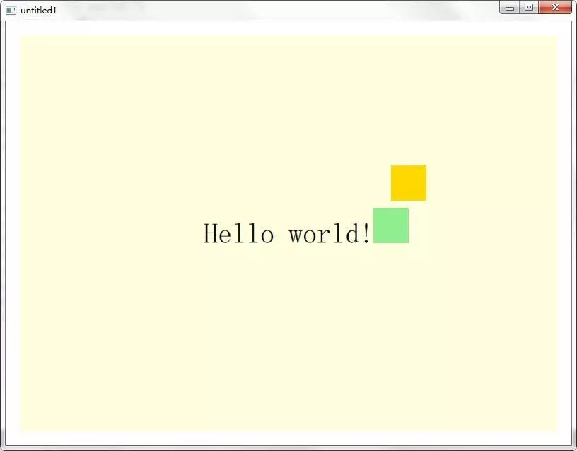
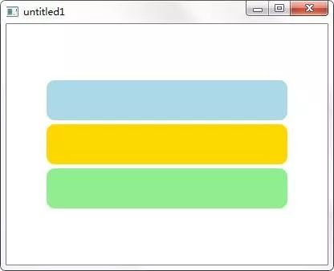
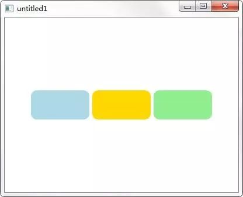
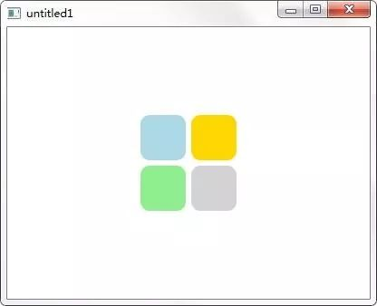
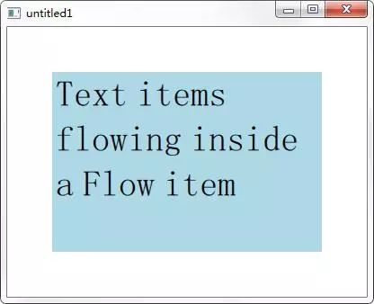
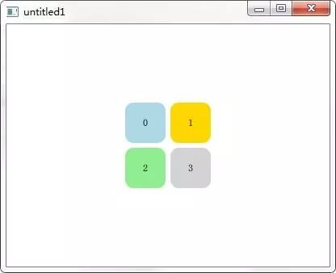

定位布局

# 导语
---
到这里，我们学习了Item、Rectangle项目，使用过 Text 、Image 等项目，也简单接触过 anchors 等布局方式，在进一步学习更多可视化项目之前，我们有必要对相关的项目定位布局方法有一个全面的认识，这会为我们后面设计规整的动态界面打下良好的基础。

下面我们开始！

# 手动定位
---
对于静态的用户界面，可以直接通过项目的 x、y 属性来为其提供一个具体的坐标，在上一篇中我们就是通过这种方式来定位Rectangle的。使用这种方式的好处是非常高效，但是，对于以创建动态交互界面见长的Qt Quick来说，`很少有项目是位置固定的，所以这种方式并不常用`。虽然这个很简单，我们前面也多次用过，但这里还是给出一个示例代码作为参考：
```qml
Item {
    width: 200
    height: 200

    Rectangle {
        x: 50
        y: 50
        width: 100
        height: 100
        color: "green"
    }

    Rectangle {
        x: 100
        y: 100
        width: 50
        height: 50
        color: "yellow"
    }
}
```
下面来看几种动态定位布局的方式。

# 通过绑定进行定位
---
在以前的示例中我们也接触过通过属性绑定来设置位置或者大小的例子，使用这种方式可以动态改变项目的位置或大小。`虽然绑定可以非常灵活和直观地创建动态布局，但需要一些性能成本，所以在可能的情况下，建议使用锚布局来代替`。

下面是通过绑定进行定位的示例代码：
```qml
Item {
    width: 400
    height: 400

    Rectangle {
        id: rect1
        x: 50
        y: 50
        width: 100
        height: 100
        color: "green"
    }

    Rectangle {
        x: rect1.x + 200
        y: rect1.y
        width: rect1.width + 10
        height: rect1.height + 10
        color: "yellow"
    }
}
```

# 基于锚的定位
---
我们在第3篇已经使用并介绍过基于锚 anchors 的布局。通过将一个项目的锚点关联到另一个项目的锚点上，可以实现高动态的界面布局。一个可视化项目可以被认为拥有一组锚点（确切的说是锚线），如下图所示，一共七个，分别是 left, horizontalCenter, right, top, verticalCenter, baseline 和 bottom 。


在上图中没有显示 baseline ，它是一条假想的线，适用于包含文本的项目，对于没有文本的项目，相当于 top 。

除了使用这里指定的锚线，还有两个比较实用的锚定方式`anchors.fill` 和 `anchors.centerIn` ，前者可以使一个项目填充到另外一个项目，相当于同时指定上下左右四个锚点；后者用于将一个项目放到另一个项目的中心，相当于同时指定水平中心和垂直中心两个锚点。

在锚系统中也提供了边距（margins）和偏移（offsets）的概念。边距就是锚线与项目边界之间的空隙，包括 leftMargin, rightMargin, topMargin 和 bottomMargin，如下图所示。如果要同时指定四个边界的边距，可以使用 anchors.margins 。而偏移可以允许使用中心锚线来进行定位。


还需要说明的是，只可以将项目与它的兄弟或者直接父项目进行锚定。

下面来看一个示例代码：

```qml
Window {
    visible: true
    width: 800
    height: 600

    Rectangle {
        anchors.fill: parent
        anchors.margins: 20
        color: "lightyellow"

        Text {
            id: text
            anchors.centerIn: parent
            text: qsTr("Hello world!")
            font.pointSize: 30
        }

        Rectangle {
            id: rect1
            width: 50
            height: 50
            anchors.bottom: text.baseline
            anchors.left: text.right
            color: "lightgreen"
        }

        Rectangle {
            width: 50
            height: 50
            anchors.horizontalCenter: rect1.horizontalCenter
            anchors.horizontalCenterOffset: 25
            anchors.bottom: rect1.top
            anchors.bottomMargin: 10
            color: "gold"
        }
    }
}
```

运行效果如下图所示。



# 定位器
---
定位器是一个容器项目，`可以用来为多个项目进行常规的布局`。包括Column 、 Row、 Grid 和 Flow。下面通过示例代码来分别查看它们的用法。

* 首先是Column：

```qml
Window {
    visible: true
    width: 400
    height: 300

    Column {
        anchors.horizontalCenter: parent.horizontalCenter
        anchors.verticalCenter: parent.verticalCenter

        spacing: 5

        Rectangle { color: "lightblue"; radius: 10.0
            width: 300; height: 50 }
        Rectangle { color: "gold"; radius: 10.0
            width: 300; height: 50}
        Rectangle { color: "lightgreen"; radius: 10.0
            width: 300; height: 50}
    }
}
```
运行效果如下图所示。



Column用于垂直排列项目，spacing 用于设置各项目之间的间距。

* 然后是Row：

```qml
Window {
    visible: true
    width: 400
    height: 300

    Row {
        anchors.horizontalCenter: parent.horizontalCenter
        anchors.verticalCenter: parent.verticalCenter

        spacing: 5

        Rectangle { color: "lightblue"; radius: 10.0
            width: 100; height: 50 }
        Rectangle { color: "gold"; radius: 10.0
            width: 100; height: 50}
        Rectangle { color: "lightgreen"; radius: 10.0
            width: 100; height: 50}
    }
}
```

运行效果如下图所示。



可以看到，Row用于水平排列其中的项目。

* 下面是Grid：

```qml
Window {
    visible: true
    width: 400
    height: 300

    Grid {
        anchors.horizontalCenter: parent.horizontalCenter
        anchors.verticalCenter: parent.verticalCenter

        columns: 2
        spacing: 6

        Rectangle { color: "lightblue"; radius: 10.0
            width: 50; height: 50 }
        Rectangle { color: "gold"; radius: 10.0
            width: 50; height: 50}
        Rectangle { color: "lightgreen"; radius: 10.0
            width: 50; height: 50}
        Rectangle { color: "lightgrey"; radius: 10.0
            width: 50; height: 50}
    }
}
```

运行效果如下图所示。



Grid可以将所有子项目放到一个包括足够多单元格的网格中，所有子项目从左到右、从上到下依次排列。Grid默认有四列，然后根据子项目的数量可以创建多个行，当然也可以通过rows、columns 来设置行数和列数。通过spacing 可以设置行和列项目之间的间距，也可以通过rowSpacing 和 columnSpacing 进行分别设置。

* 下面是Flow：

```qml
Window {
    visible: true
    width: 400
    height: 300

    Rectangle {
        anchors.centerIn: parent
        color: "lightblue"
        width: 300; height: 200

        Flow {
            anchors.fill: parent
            anchors.margins: 4
            spacing: 10

            Text { text: "Text"; font.pixelSize: 40 }
            Text { text: "items"; font.pixelSize: 40 }
            Text { text: "flowing"; font.pixelSize: 40 }
            Text { text: "inside"; font.pixelSize: 40 }
            Text { text: "a"; font.pixelSize: 40 }
            Text { text: "Flow"; font.pixelSize: 40 }
            Text { text: "item"; font.pixelSize: 40 }
        }
    }
}
```

运行效果如下图所示。



Flow排列项目的规则与Grid相似，不同的是，Flow的子项目会在超出边界后自动换行，每行的子项目数不一定相同。

* Positioner 类型：该类型为定位器中的顶层子项目提供了index、 isFirstItem、 isLastItem 三个附加属性，可以让位于定位器中的子项目获取索引等相关信息。

例如我们为前面代码Grid中的每个Rectangle子项目都添加一个文本Text：

```qml
Rectangle { 
    color: "lightblue"; 
    radius: 10.0
    width: 50; 
    height: 50
    Text { 
        anchors.centerIn: parent; 
        text: parent.Positioner.index
    }
}
```

注意，这里因为Rectangle是Grid的顶层子项目，所以它可以使用 `Positioner` 提供的附加属性，在Text 中需要通过 `parent.Positioner` 来获取。运行效果如下图所示。



# 布局管理器
---
从Qt 5.1开始，新提供的 Qt Quick Layouts模块提供了几个布局管理器项目，与前面的定位器不同，`布局管理器可以同时管理项目的位置和大小，它们非常适合可调整大小的用户界面`。布局管理器包括ColumnLayout、RowLayout、 GridLayout 和 StackLayout ，另外，还有一个Layout类型为放入布局管理器中的子项目提供了一些布局相关的附加属性。

下面以 ColumnLayout 为例，来看一下布局管理器的使用：

```qml
import QtQuick 2.9
import QtQuick.Window 2.2
import QtQuick.Layouts 1.12

Window {
    visible: true
    width: 100
    height: 300

    ColumnLayout{
        anchors.fill: parent
        spacing: 2

        Rectangle {
            Layout.alignment: Qt.AlignCenter
            color: "gold"
            Layout.preferredWidth: 40
            Layout.preferredHeight: 40
        }

        Rectangle {
            Layout.alignment: Qt.AlignRight
            color: "lightgreen"
            Layout.preferredWidth: 40
            Layout.preferredHeight: 70
        }

        Rectangle {
            Layout.alignment: Qt.AlignBottom
            Layout.fillHeight: true
            color: "lightblue"
            Layout.preferredWidth: 70
            Layout.preferredHeight: 40
        }
    }
}
```

运行效果如下图所示。


因为布局管理器作为单独的模块进行提供，所以，在使用前需要添加导入语句 `import QtQuick.Layouts 1.12` 。ColumnLayout 会在垂直方向上布局项目，而对于其中项目的具体布局设置，需要通过Layout 附加属性来进行，比如这里的Layout.alignment 用于设置对齐方式，Layout.preferredWidth 用来设置建议的宽度，Layout.fillHeight 指明该项目会填充高度，也就是说当界面被拉伸，出现更多空间的时候，该项目的高度会自动增加来填充这些空间。大家可以运行程序，然后放大缩小界面查看效果。

另外的RowLayout、 GridLayout 用法与ColumnLayout类似，大家也可以参照前面定位器的代码，这里就不再讲解。下面来看一下 StackLayout 的应用：

```qml
import QtQuick 2.9
import QtQuick.Window 2.2
import QtQuick.Layouts 1.12

Window {
    visible: true
    width: 400
    height: 300

    StackLayout {
        id: layout
        anchors.fill: parent
        currentIndex: 1

        Rectangle {
            color: 'teal'
            implicitWidth: 200
            implicitHeight: 200
        }

        Rectangle {
            color: 'plum'
            implicitWidth: 300
            implicitHeight: 200
        }
    }

    MouseArea {
        anchors.fill: parent
        onClicked: {
            console.log(layout.count)
            layout.currentIndex == 1 ?
                        layout.currentIndex = 0
                      : layout.currentIndex = 1
        }
    }
}
```

运行效果如下图所示。


StackLayout 提供了一个一次只能显示一个项目的项目堆栈，它只包含count 和 currentIndex 两个特有属性，前者用来获取子项目的数量，后者用来设置当前显示项目的索引。放在StackLayout 中的子项目默认设置为了 Layout.fillWidth 和 Layout.fillHeight ，也就是说默认会填充整个布局区域。

# 结语
---
这一篇我们罗列了在Qt Quick中常用的几种定位布局方法，虽然没有深入讲解，但因为比较简单而且经常用到，所以以后会很容易掌握。这一篇的重点，也是大家比较关心的问题，就是这些布局方法有什么区别，在什么时候该用哪种方式，其实我们在教程中已经通过字体加粗进行标识了，没有留意的同学可以再看一下。