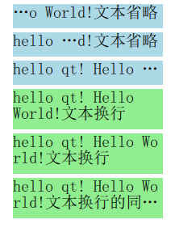
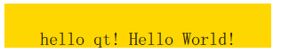

文本显示和字体

# 导语
---
文本显示是界面开发必不可少的内容，在Qt Quick模块中提供了 Text 项目来进行文本的显示，其中可以使用 `font` 属性组对文本字体进行设置。这一篇我们来看看它们的具体使用。

# 使用字体
---
就像前面教程中提到过的，在文本中可以使用 font 属性组来设置字体，常用的属性如下：

* font.bold：是否加粗，取值为true或false
* font.capitalization：大写策略，取值为
* Font.MixedCase不改变大小写（默认值）；
* Font.AllUppercase全部大写；
* Font.AllLowercase全部小写；
* Font.SmallCaps小型大写字母（即小写字母变为大写但不改变字体原始的大小）；
* Font.Capitalize：首字母大写
* font.family：字体族，取值为字体族的名字（区分大小写）
* font.italic：是否斜体，取值为true或false
* font.letterSpacing：字符间距，正值加大间距，负值减小间距
* font.pixelSize：字号大小，取值为整数（单位为像素，依赖于设备）
* font.pointSize：字号大小，取值为大于0的值（是设备无关的）
* font.strikeout：是否有删除线，取值为true或false
* font.underline：是否有下划线，取值为true或false
* font.weight：字体重量，取值为Font.Thin、Font.Light、Font.ExtraLight、Font.Normal（默认）、Font.Medium、Font.DemiBold、Font.Bold、Font.ExtraBold 和 Font.Black
* font.wordSpacing：单词间距，正值加大间距，负值减小间距

我们可以直接使用点表示法来使用一个属性，也可以使用组表示法来一次指定多个属性，建议使用组表示法，这样代码的可读性更好。下面来看一个示例：

```qml
Text {
    id: text1
    anchors.centerIn: parent
    text: "hello qt! Hello World!"
}

Text {
    id: text2
    anchors.top: text1.bottom
    anchors.topMargin: 10
    anchors.horizontalCenter: text1.horizontalCenter
    text: "hello qt! Hello World!"

    font.weight: Font.ExtraBold
    font.pointSize: 20
    font.letterSpacing: 3
    font.wordSpacing: 6
    font {
        capitalization: Font.AllLowercase
        italic: true
        underline: true
    }
    font.family: webFont.name
    FontLoader {
        id: webFont
        source: "http://qter-images.qter.org/other/myfont.ttf"
        onStatusChanged: if (webFont.status == FontLoader.Ready)
                                 console.log('Loaded')
    }
}
```

这里最后使用了 FontLoader 类型来加载一个字体，可以通过设置 `source` 属性来指定一个字体名称或者网络 `url` 地址，比如这里使用了网上的一个 ttf 字体，当使用网络字体时，可以通过 `status` 属性来获取加载的状态。下图是运行效果。


# 文本裁剪
---
Text 项目是可以设置宽度的，当里面的文本内容超出 Text 的宽度时，可以使用 `clip` 属性设置文本是否被裁剪。下面来看一个例子：

```qml
Column{
    anchors.centerIn: parent
    spacing: 5

    Rectangle {
        width: 186; height: 30
        color: "lightblue"

        Text {
            text: "hello qt! Hello World!"
            font.pointSize: 15
        }
    }
    Rectangle {
        width: 186; height: 30
        color: "lightblue"

        Text {
            text: "hello qt! Hello World!"
            font.pointSize: 15
            width: 186
            clip: true
        }
    }

    Rectangle {
        width: 186; height: 30
        color: "lightgreen"

        Text {
            anchors.centerIn: parent
            text: "hello qt! Hello World!"
            font.pointSize: 15
        }
    }

    Rectangle {
        width: 186; height: 30
        color: "lightgreen"

        Text {
            anchors.centerIn: parent
            text: "hello qt! Hello World!"
            font.pointSize: 15
            width: 186
            clip: true
        }
    }
}
```

运行效果如下图所示。


# 文本省略
---
如果使用 `clip` 属性，当文本超出边界后会被突然截断，这样可能在边界只显示了单词或字母的局部，非常不友好。在 Text 中还提供了 `elide` 属性，可以通过省略文本的部分内容来匹配文本的宽度，其取值包括`Text.ElideNone （默认）`、`Text.ElideLeft`、`Text.ElideMiddle` 和 `Text.ElideRight` ，需要注意的是，该属性也是在设置了 Text 宽度时才有作用。下面看一段示例代码：

```qml
Column{
    anchors.centerIn: parent
    spacing: 5

    Rectangle {
        width: 186; height: 30
        color: "lightblue"

        Text {
            width: 186
            text: qsTr("hello qt! Hello World!文本省略")
            font.pointSize: 15
            elide: Text.ElideLeft
        }
    }

    Rectangle {
        width: 186; height: 30
        color: "lightblue"

        Text {
            width: 186
            text: qsTr("hello qt! Hello World!文本省略")
            font.pointSize: 15
            elide: Text.ElideMiddle
        }
    }

    Rectangle {
        width: 186; height: 30
        color: "lightblue"

        Text {
            width: 186
            text: qsTr("hello qt! Hello World!文本省略")
            font.pointSize: 15
            elide: Text.ElideRight
        }
    }
}
```

运行效果如下图所示。


# 文本换行
---
对于过长的文本，除了进行省略以外，也可以使用 `wrapMode` 来设置换行，可用的换行模式包括：`Text.NoWrap (默认)` 、`Text.WordWrap`、`Text.WrapAnywhere` 和`Text.Wrap` 。当设定了 Text 的高度 `height`，或者最大行数 `maximumLineCount` 后，换行和省略可以同时使用。下面来看一个例子，在前面代码的基础上继续添加如下代码：

```qml
Rectangle {
    width: 186; height: 50
    color: "lightgreen"

    Text {
        width: 186
        text: qsTr("hello qt! Hello World!文本换行")
        font.pointSize: 15
        wrapMode: Text.WordWrap
    }
}

Rectangle {
    width: 186; height: 50
    color: "lightgreen"

    Text {
        width: 186
        text: qsTr("hello qt! Hello World!文本换行")
        font.pointSize: 15
        wrapMode: Text.WrapAnywhere
    }
}

Rectangle {
    width: 186; height: 50
    color: "lightgreen"

    Text {
        width: 186; height: 50
        text: qsTr("hello qt! Hello World!文本换行的同时也可以省略")
        font.pointSize: 15
        wrapMode: Text.WrapAnywhere
        elide: Text.ElideRight
    }
}
```

运行效果如下图所示。



# 文本样式
---
使用 Text 的 `style` 属性可以设置文本的样式，包括：`Text.Normal(默认)`、`Text.Outline`、`Text.Raised` 和 `Text.Sunken` ，下面是示例：

```qml
Row { 
    spacing: 10

    Text { font.pointSize: 24; text: "Normal" }

    Text { font.pointSize: 24; text: "Raised"; color: "white"
        style: Text.Raised; styleColor: "blue" }

    Text { font.pointSize: 24; text: "Outline";
        style: Text.Outline; styleColor: "red" }

    Text { font.pointSize: 24; text: "Sunken"; color: "white"
        style: Text.Sunken; styleColor: "black" }
}
```

运行效果如下图所示。


# 对齐方式
---

当设置了 Text 的宽度和高度以后，可以通过 `horizontalAlignment` 和 `verticalAlignment` 来设置文本内容的对齐方式，水平方向包括：`Text.AlignLeft`、 `Text.AlignRight`、 `Text.AlignHCenter` 和 `Text.AlignJustify`；垂直方向包括：`Text.AlignTop`、 `Text.AlignBottom`  和 `Text.AlignVCenter` 。下面是示例代码：

```qml
Rectangle {
    width: 300; height: 50
    color: "gold"

    Text {
        width: 300; height: 50
        text: qsTr("hello qt! Hello World!")
        font.pointSize: 15
        horizontalAlignment: Text.AlignHCenter
        verticalAlignment: Text.AlignBottom
    }
}
```

运行效果如下图所示。



# 显示富文本
---

Text 项目除了显示纯文本以外，也可以显示富文本。通过 `textFormat` 属性可以设置文本格式，包括：

* Text.AutoText (默认)：自动判断以什么样式来进行显示；
* Text.PlainText：以纯文本进行显示；
* Text.StyledText：是一种支持基本文本样式标签的优化格式，例如HTML 3.2中的标签：

```
<b></b>
<strong></strong>
<i></i>
<br>
<p>
<u>
<font color="color_name" size="1-7"></font>
<h1> to <h6>
<a href="">

<ol type="">, <ul type=""> , <li>
<pre></pre>
&gt; &lt; &amp;
```
* Text.RichText：可以显示富文本，支持 HTML 4 规范的标签，具体支持的标签内容可以在帮助 `Supported HTML Subset` 文档种进行查看。为了获取更好的性能，建议使用 `Text.PlainText` 或 `Text.StyledText` 。

下面是示例代码：

```qml
Text {
    font.pointSize: 24
    text: "<b>Hello</b> <i>World!</i>"
}
Text {
    font.pointSize: 24
    textFormat: Text.StyledText
    text: "<b>Hello</b> <i>World!</i>"
}
Text {
    font.pointSize: 24
    textFormat: Text.RichText
    text: "<b>Hello</b> <i>World!</i>"
}
Text {
    font.pointSize: 24
    textFormat: Text.PlainText
    text: "<b>Hello</b> <i>World!</i>"
}
```

效果如下图所示：


# 结语
---
这里列举了 Text 项目相关的一些常用属性设置，然而，还有很多功能和属性没能涉及，大家可以在需要使用的时候参阅 Text 的帮助文档。


