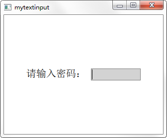

文本输入

# 导语
---
在前面一篇中我们讲到了用于文本显示的 Text 项目，这一篇来看两个用于文本输入的项目，分别是作为单行文本输入的 TextInput 和多行文本输入的 TextEdit 。

下面开始教程。

# TextInput
---
TextInput 项目用来显示单行可编辑的纯文本。TextInput 是一个非常简单的项目，除了显示光标和文本外，默认并没有边框等装饰性效果，所以在使用时一般要为其添加一个可视化的外观。

先来看一个例子：

```qml
Window {
    visible: true
    width: 320
    height: 240

    Row {
        spacing: 10
        anchors.centerIn: parent

        Text { text: qsTr("请输入密码：") ; font.pointSize: 15
            verticalAlignment: Text.AlignVCenter }

        Rectangle {
            width: 100
            height: 24
            color: "lightgrey"
            border.color: "grey"

            TextInput {
                anchors.fill: parent
                anchors.margins: 2
                font.pointSize: 15
                focus: true
            }
        }
    }
}
```

程序运行效果如下图所示。



## 1.自适应输入框尺寸
按照前面的代码已经为 TextInput 设置了一个基本的外观，但是如果输入过多的内容时，会显示到背景之外，如下图所示：


所以要根据输入的内容来动态改变输入框背景的尺寸，这个可以通过 `contentWidth` 和 `contentHeight` 属性来根据输入内容的宽高设置背景矩形的大小，将前面代码更改如下：

```qml
Rectangle {
    width: input.contentWidth<100 ? 100 : input.contentWidth + 10
    height: input.contentHeight + 5
    color: "lightgrey"
    border.color: "grey"

    TextInput {
        id: input
        anchors.fill: parent
        anchors.margins: 2
        font.pointSize: 15
        focus: true
    }
}
```

运行效果如下图所示。


## 2.输入掩码
可以使用输入掩码 `inputMask` 来限制输入的内容，输入掩码就是使用一些特殊的字符来限制输入的格式和内容，比如掩码 `A` 指定必须输入一个字母 A-Z或a-z，而掩码 `a` 与其类似，只是不强制输入，可以用留空。可用的掩码字符如下表所示。

|字符（必须输入）|字符（可留空）|含义|
|:-:|:-:|:-:|
|A|a|只能输入A-Z，a-z|
|N|n|只能输入A-Z，a-z，0-9|
|X|x|可以输入任意字符|
|9|0|只能输入0-9|
|D|d|只能输入1-9|
||#|只能输入加号（+），减号（-），0-9|
|H|h|只能输入十六进制字符，A-F，a-f，0-9|
|B|b|只能输入二进制字符，0或1|

|字符|含义|
|:-:|:-:|
|>|后面的字母字符自动转换为大写|
|<|后面的字母字符自动转换为小写|
|!|停止字母字符的大小写转换|
|[ ] { }|括号中的内容会直接显示出来|
|\</td>|将该表中的特殊字符正常显示用作分隔符|

下面来看示例代码：

```qml
Rectangle {
    width: input.contentWidth<100 ? 100 : input.contentWidth + 10
    height: input.contentHeight + 5
    color: "lightgrey"
    border.color: "grey"

    TextInput {
        id: input
        anchors.fill: parent
        anchors.margins: 2
        font.pointSize: 15
        focus: true

        inputMask: ">AA_9_a"
        onEditingFinished: text2.text = text
    }
}

Text { id: text2}
```

当输入完成后可以按下回车键，这时会调用 `onEditingFinished` 信号处理器，在其中可以对输入的文本进行处理。注意，只有当所有必须输入的字符都输入后，按下回车键才可以调用该信号处理器，比如这里的掩码字符 `9` 要求必须输入一个数字，如果不输入而是直接留空，那么按下回车键也没有效果。代码运行效果如下图所示。


## 3.验证器
除了使用掩码，还可以使用整数验证器 `IntValidator` 、`DoubleValidator（非整数验证器）`和`RegExpValidator（正则表达式验证器）`。下面的代码可以限制在TextInput中只能输入11到31之间的整数：

```qml
validator: IntValidator{ bottom: 11; top: 31; }
```

对于正则表达式的使用，可以参考网上教程，或者参考《Qt Creator快速入门（第3版）》第7章的相关内容。

## 4.回显方式
TextInput项目的 `echoMode` 属性指定了文本的显示方式，可用的方式有：

* TextInput.Normal：直接显示文本（默认方式）；
* TextInput.Password：使用密码掩码字符（根据不同平台显示效果不同）来代替真实的字符；
* TextInput.NoEcho：不显示输入的内容；
* TextInput.PasswordEchoOnEdit：使用密码掩码字符，但在输入时显示真实字符。

下面来看示例代码：

```qml
focus: true
echoMode: TextInput.PasswordEchoOnEdit

onEditingFinished: {
    input.focus = false
    text2.text = text
}
```
代码先设置了 TextInput 获得焦点，这样输入字符会直接显示，等输入完成按下回车键以后使 TextInput 失去焦点，这样输入的字符会用密码掩码显示。效果如下图所示。


# TextEdit
---
TextEdit 项目与 TextInput 类似，不同之处在于，TextEdit 用来显示多行的可编辑的格式化文本，它既可以显示纯文本也可以显示富文本。如下面的代码所示：

```qml
Window {
    visible: true
    width: 640
    height: 480

    TextEdit {
        width: 240
        textFormat: Text.RichText
        text: "<b>Hello</b> <i>World!</i>"
        font.family: "Helvetica"
        font.pointSize: 20
        color: "blue"
        focus: true
    }
}
```

运行代码可以看到，TextEdit没有提供滚动条、光标跟随和其它在可视部件中通常具有的行为。为了更加人性化的体验，我们可以使用 `Flickable` 来为其提供滚动，实现光标跟随。下面来看一段示例代码：

```qml
Flickable {
    id: flick

    anchors.fill: parent
    contentWidth: edit.paintedWidth
    contentHeight: edit.paintedHeight
    clip: true

    function ensureVisible(r)
    {
        if (contentX >= r.x)
            contentX = r.x;
        else if (contentX+width <= r.x+r.width)
            contentX = r.x+r.width-width;
        if (contentY >= r.y)
            contentY = r.y;
        else if (contentY+height <= r.y+r.height)
            contentY = r.y+r.height-height;
    }

    TextEdit {
        id: edit
        width: flick.width
        height: flick.height
        font.pointSize: 15
        wrapMode: TextEdit.Wrap
        focus: true
        onCursorRectangleChanged:
            flick.ensureVisible(cursorRectangle)
    }
}

Rectangle {
    id: scrollbar
    anchors.right: flick.right
    y: flick.visibleArea.yPosition * flick.height
    width: 10
    height: flick.visibleArea.heightRatio * flick.height
    color: "lightgrey"
}
```

这里使用的 Flickable 类型到后面会详细讲解。在 TextEdit 中可以设置 `selectByMouse` 属性为 true 来使鼠标可以选取文本内容，可以直接通过键盘快捷键实现文本的复制、粘贴、撤销等操作，当然也可以使用相应的函数来完成。运行效果如下图所示。


# 结语
---
作为两个基本的文本输入项目，TextInput 和 TextEdit 实现了应有的基本功能，但因为它们基本的外观等设置的缺失，使用起来也需要费些力气，在后面的Qt Quick Controls 2 模块中我们还会介绍功能相同的其他部件，大家到时候可以做个比较。
