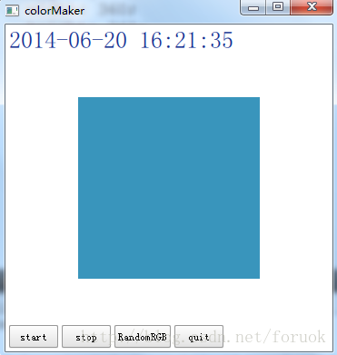
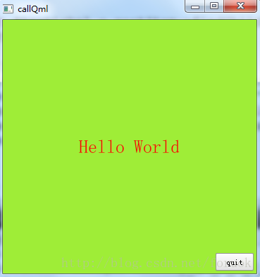

 Qt Quick 技术的引入，使得你能够快速构建 UI ，具有动画、各种绚丽效果的 UI 都不在话下。但它不是万能的，也有很多局限性，原来 Qt 的一些技术，比如低阶的网络编程如 QTcpSocket ，多线程，又如 XML 文档处理类库 QXmlStreamReader/QXmlStreamWriter 等等，在 QML 中要么不可用，要么用起来不方便，所以呢，很多时候我们是会基于这样的原则来混合使用 QML 和 C++, QML 构建界面, C++ 实现非界面的业务逻辑和复杂运算。

# 导语
---
那这篇呢，我们就来看看 QML 和 C++ 之间如何交互。

其实话说回来， QML 的很多基本类型原本就是在 C++ 中实现的，比如 Item 对应 QQuickItem , Image 对应 QQuickImage , Text 对应 QQuickText ，这样看来，在 QML 中访问 C++ 对象必然不成问题。然也！反过来，在 C++ 中其实也可以使用 QML 对象。

对于这两种情景，我们分别讲述。先看如何在 QML 中使用 C++ 类和对象。

首先我们需要创建一个 Qt Quick App ，建立一个名为 colorMaker 的项目，接下来我们的学习将会伴随 colorMaker 项目进行，等我们讲完，一个完整的 colorMaker 项目也会完成。需要新建两个文件， colorMaker.h 和 colorMaker.cpp 。

colorMaker 只是一个示例项目，我在 C++ 中实现一个 ColorMaker 类，它可以被注册为一个 QML 类型供 QML 像内建类型一样使用，它的实例也可以导出为 QML 上下文属性在 QML 中访问。我们的示例只是在界面顶部显示当前时间（时间文字的颜色随时间变化而变化），在界面中间显示一个变色矩形，在界面底部放置几个按钮来控制颜色如何变化。



# 在 QML 中使用 C++ 类和对象
---
我们知道， QML 其实是对 JavaScript 的扩展，融合了 Qt Object 系统，它是一种新的解释型的语言， QML 引擎虽然由 Qt C++ 实现，但 QML 对象的运行环境，说到底和 C++ 对象的上下文环境是不同的，是平行的两个世界。如果你想在 QML 中访问 C++ 对象，那么必然要找到一种途径来在两个运行环境之间建立沟通桥梁。

Qt 提供了两种在 QML 环境中使用 C++ 对象的方式：
1. **`在 C++ 中实现一个类，注册到 QML 环境中， QML 环境中使用该类型创建对象`**
2. **`在 C++ 中构造一个对象，将这个对象设置为 QML 的上下文属性，在 QML 环境中直接使用改属性`**

不管哪种方式，对要导出的 C++ 类都有要求，不是一个类的所有方法、变量都可以被 QML 使用，因此我们先来看看怎样让一个方法或属性可以被 QML 使用。

## 实现可以导出的 C++ 类
---
### 前提条件
要想将一个类或对象导出到 QML 中，下列前提条件必须满足：
1. **`从 QObject 或 QObject 的派生类继承`**
2. **`使用 Q_OBJECT 宏`**

看起来好像和使用信号与槽的前提条件一样,没错，的确是一样的。这两个条件是为了让一个类能够进入 Qt 强大的元对象系统（meta-object system）中，只有使用元对象系统，一个类的某些方法或属性才可能通过字符串形式的名字来调用，才具有了在 QML 中访问的基础条件。
一旦你导出了一个类，在 QML 中就必然要访问该类的实例的属性或方法来达到某种目的，否则我真想不来你要干什么,而具有什么特征的属性或方法才可以被 QML 访问呢？

### 信号&槽
只要是信号或者槽，都可以在 QML 中访问，你可以把 C++ 对象的信号连接到 QML 中定义的方法上，也可以把 QML 对象的信号连接到 C++ 对象的槽上，还可以直接调用 C++ 对象的槽或信号,所以，这是最简单好用的一种途径。

下面初始 ColorMaker 类的声明：

```c++
class ColorMaker : public QObject
{
    Q_OBJECT
 
public:
    ColorMaker(QObject *parent = 0);
    ~ColorMaker();
    
signals:
    void colorChanged(const QColor & color);
    void currentTime(const QString &strTime);
 
public slots:
    void start();
    void stop();
    
};
```
我们定义了 start() / stop() 两个槽， colorChanged() / currentTime() 两个信号，都可以在 QML 中使用。

### Q_INVOKABLE 宏
在定义一个类的成员函数时使用 Q_INVOKABLE 宏来修饰，就可以让该方法被元对象系统调用。这个宏`必须放在返回类型前面`。我给 ColorMaker 添加了两个使用 Q_INVOKABLE 宏修饰的方法，现在 ColorMaker 类的声明变成了这个样子：

```c++
class ColorMaker : public QObject
{
    Q_OBJECT
 
public:
    ColorMaker(QObject *parent = 0);
    ~ColorMaker();
    
    Q_INVOKABLE GenerateAlgorithm algorithm() const;
    Q_INVOKABLE void setAlgorithm(GenerateAlgorithm algorithm);
 
signals:
    void colorChanged(const QColor & color);
    void currentTime(const QString &strTime);
 
public slots:
    void start();
    void stop();
};
```
一旦你使用 Q_INVOKABLE 将某个方法注册到元对象系统中，在 QML 中就可以用 `${Object}.${method}` 来访问，colorMaker 的 main.qml 中有使用 algorithm() 和 setAlgorithm() 的 QML 代码 ：

```qml
    Component.onCompleted: {
        colorMaker.color = Qt.rgba(0,180,120, 255);
        colorMaker.setAlgorithm(ColorMaker.LinearIncrease);
        changeAlgorithm(colorAlgorithm, colorMaker.algorithm());
    }
```
我在根元素创建完成时初始化 `colorMaker` 对象，给它设定了颜色生成算法，同时改变界面上切换颜色生成算法的按钮的文字。

### Q_ENUMS
如果你要导出的类定义了想在 QML 中使用枚举类型，可以使用 Q_ENUMS 宏将该枚举注册到元对象系统中。ColorMaker 类定义了 GenerateAlgorithm 枚举类型，支持 RandomRGB / RandomRed 等颜色生成算法。现在 ColorMaker 类的声明变成了这个样子：

```c++
class ColorMaker : public QObject
{
    Q_OBJECT
    Q_ENUMS(GenerateAlgorithm)
 
public:
    ColorMaker(QObject *parent = 0);
    ~ColorMaker();
    
    enum GenerateAlgorithm{
        RandomRGB,
        RandomRed,
        RandomGreen,
        RandomBlue,
        LinearIncrease
    };
    
    Q_INVOKABLE GenerateAlgorithm algorithm() const;
    Q_INVOKABLE void setAlgorithm(GenerateAlgorithm algorithm);
 
signals:
    void colorChanged(const QColor & color);
    void currentTime(const QString &strTime);
 
public slots:
    void start();
    void stop();
};
```

一旦你使用 Q_ENUMS 宏注册了你的枚举类型，在 QML 中就可以用 `${CLASS_NAME}.${ENUM_VALUE}` 的形式来访问，比如 `ColorMaker.LinearIncrease` ，上节展示的 QML 代码片段已经使用了导出的枚举类型。

### Q_PROPERTY
Q_PROPERTY 宏用来定义可通过元对象系统访问的属性，通过它定义的属性，可以在 QML 中访问、修改，也可以在属性变化时发射特定的信号。要想使用 Q_PROPERTY 宏，你的类必须是 QObject 的后裔，必须在类首使用 Q_OBJECT 宏。
下面是 Q_PROPERTY 宏的原型：

```
Q_PROPERTY(type name
           (READ getFunction [WRITE setFunction] |
            MEMBER memberName [(READ getFunction | WRITE setFunction)])
           [RESET resetFunction]
           [NOTIFY notifySignal]
           [REVISION int]
           [DESIGNABLE bool]
           [SCRIPTABLE bool]
           [STORED bool]
           [USER bool]
           [CONSTANT]
           [FINAL])
```

是不是很复杂？你可以为一个属性命名，可以设定的选项数超过10个,我是觉得有点儿头疼。不过，不是所有的选项都必须设定，看一个最简短的属性声明：

```
Q_PROPERTY(int x READ x)
```

上面的声明定义了一个类型为 int 名为 x 的属性，通过方法 x() 来访问。
type name 这两个字段想必不用细说了吧？ type 是属性的类型，可以是 int / float / QString / QObject / QColor / QFont 等等， name 就是属性的名字。
其实我们在实际使用中，很少能够用全 Q_PROPERTY 的所有选项，就往 QML 导出类这种场景来说，比较常用的是 READ / WRITE / NOTIFY 三个选项。我们来看看都是什么含义。

* **`READ 标记，如果你没有为属性指定 MEMBER 标记，则 READ 标记必不可少；声明一个读取属性的函数，该函数一般没有参数，返回定义的属性。`**
* **`WRITE 标记，可选配置。声明一个设定属性的函数。它指定的函数，只能有一个与属性类型匹配的参数，必须返回 void 。`**
* **`NOTIFY 标记，可选配置。给属性关联一个信号（该信号必须是已经在类中声明过的），当属性的值发生变化时就会触发该信号。信号的参数，一般就是你定义的属性。`**

其它标记的含义，请参考 Qt SDK 。
QML 中的 Text 类型对应 C++ 中的 QQuickText 类，下面是我摘取的部分代码，可以看到 Q_ENUMS 和 Q_PROPERTY 的使用：

```c++
class QQuickText : public QQuickImplicitSizeItem
{
    Q_OBJECT
    Q_ENUMS(HAlignment)
 
 
    Q_PROPERTY(QString text READ text WRITE setText NOTIFY textChanged)
    Q_PROPERTY(QFont font READ font WRITE setFont NOTIFY fontChanged)
    Q_PROPERTY(QColor color READ color WRITE setColor NOTIFY colorChanged)
    ...
    
public:
    enum HAlignment { AlignLeft = Qt::AlignLeft,
                       AlignRight = Qt::AlignRight,
                       AlignHCenter = Qt::AlignHCenter,
                       AlignJustify = Qt::AlignJustify };
    ...
    QString text() const;
    void setText(const QString &);
 
    QFont font() const;
    void setFont(const QFont &font);
 
    QColor color() const;
    void setColor(const QColor &c);
    ...
};
```

现在给我们的 ColorMaker 类添加一些属性，以便 QML 可以获取、设置颜色值。新的 ColorMaker 类如下：

```c++
class ColorMaker : public QObject
{
    Q_OBJECT
    Q_ENUMS(GenerateAlgorithm)
    Q_PROPERTY(QColor color READ color WRITE setColor NOTIFY colorChanged)
    Q_PROPERTY(QColor timeColor READ timeColor)
 
public:
    ColorMaker(QObject *parent = 0);
    ~ColorMaker();
 
    enum GenerateAlgorithm{
        RandomRGB,
        RandomRed,
        RandomGreen,
        RandomBlue,
        LinearIncrease
    };
 
    QColor color() const;
    void setColor(const QColor & color);
    QColor timeColor() const;
 
    Q_INVOKABLE GenerateAlgorithm algorithm() const;
    Q_INVOKABLE void setAlgorithm(GenerateAlgorithm algorithm);
 
signals:
    void colorChanged(const QColor & color);
    void currentTime(const QString &strTime);
 
public slots:
    void start();
    void stop();
 
protected:
    void timerEvent(QTimerEvent *e);
 
private:
    GenerateAlgorithm m_algorithm;
    QColor m_currentColor;
    int m_nColorTimer;
};
```

现在我们的 ColorMaker 已经是一个完整的类了，有信号、有槽、有使用 Q_INVOKABLE 注册的方法，还导出了枚举类型，小小麻雀五脏俱全。是时候看看它的实现了。

```c++
#include "colorMaker.h"
#include <QTimerEvent>
#include <QDateTime>
 
ColorMaker::ColorMaker(QObject *parent)
    : QObject(parent)
    , m_algorithm(RandomRGB)
    , m_currentColor(Qt::black)
    , m_nColorTimer(0)
{
    qsrand(QDateTime::currentDateTime().toTime_t());
}
 
ColorMaker::~ColorMaker()
{
}
 
QColor ColorMaker::color() const
{
    return m_currentColor;
}
 
void ColorMaker::setColor(const QColor &color)
{
    m_currentColor = color;
    emit colorChanged(m_currentColor);
}
 
QColor ColorMaker::timeColor() const
{
    QTime time = QTime::currentTime();
    int r = time.hour();
    int g = time.minute()*2;
    int b = time.second()*4;
    return QColor::fromRgb(r, g, b);
}
 
ColorMaker::GenerateAlgorithm ColorMaker::algorithm() const
{
    return m_algorithm;
}
 
void ColorMaker::setAlgorithm(GenerateAlgorithm algorithm)
{
    m_algorithm = algorithm;
}
 
void ColorMaker::start()
{
    if(m_nColorTimer == 0)
    {
        m_nColorTimer = startTimer(1000);
    }
}
 
void ColorMaker::stop()
{
    if(m_nColorTimer > 0)
    {
        killTimer(m_nColorTimer);
        m_nColorTimer = 0;
    }
}
 
void ColorMaker::timerEvent(QTimerEvent *e)
{
    if(e->timerId() == m_nColorTimer)
    {
        switch(m_algorithm)
        {
        case RandomRGB:
            m_currentColor.setRgb(qrand() % 255, qrand() % 255, qrand() % 255);
            break;
        case RandomRed:
            m_currentColor.setRed(qrand() % 255);
            break;
        case RandomGreen:
            m_currentColor.setGreen(qrand() % 255);
            break;
        case RandomBlue:
            m_currentColor.setBlue(qrand() % 255);
            break;
        case LinearIncrease:
            {
                int r = m_currentColor.red() + 10;
                int g = m_currentColor.green() + 10;
                int b = m_currentColor.blue() + 10;
                m_currentColor.setRgb(r % 255, g % 255, b % 255);
            }
            break;
        }
        emit colorChanged(m_currentColor);
        emit currentTime(QDateTime::currentDateTime().toString("yyyy-MM-dd hh:mm:ss"));
    }
    else
    {
        QObject::timerEvent(e);
    }
}
 ```

我使用一个周期为 1000 的定时器来产生颜色，定时器触发时根据算法来构造新的颜色值，发射 colorChanged 信号，同时也发送一个 currentTime 信号。

# 注册一个 QML 中可用的类型
看过了怎样实现一个可供 QML 访问的类，这节我们看看怎样将一个 C++ 类型注册为 QML 类型以及怎样在 QML 中使用这个类型。要达到这种目的，大概可以分四步：

1. 实现 C++ 类
2. 注册 QML 类型
3. 在 QML 中导入类型
4. 在 QML 创建由 C++ 导出的类型的实例并使用

ColorMaker 已经就绪了，现在看看怎样将其注册为 QML 可以使用的类型。

## 注册 QML 类型
要注册一个 QML 类型，有多种方法可用，如 `qmlRegisterSingletonType() 用来注册一个单例类型`， `qmlRegisterType() 注册一个非单例的类型`，`qmlRegisterTypeNotAvailable() 注册一个类型用来占位`，`qmlRegisterUncreatableType() 通常用来注册一个具有附加属性的附加类型`，好吧，我这里只说常规的类型注册，其它的，请您参考 Qt SDK 吧。`qmlRegisterType()` 是个模板函数，有两个原型：

```c++
template<typename T>
int qmlRegisterType(const char *uri, int versionMajor, int versionMinor, const char *qmlName);
 
template<typename T, int metaObjectRevision>
int qmlRegisterType(const char *uri, int versionMajor, int versionMinor, const char *qmlName);
```

前一个原型一般用来注册一个新类型，而后一个可以为特定的版本注册类型。后面这个牵涉到 Qt Quick 的类型和版本机制，三言两语不能尽述，咱们单说前一个原型的使用。要使用 qmlRegisterType 需要包含 QtQml 头文件。

先说模板参数 typename ，它就是你实现的 C++ 类的类名。

qmlRegisterType() 的第一个参数 uri ，让你指定一个唯一的包名，类似 Java 中的那种，一是用来避免名字冲突，而是可以把多个相关类聚合到一个包中方便引用。比如我们常写这个语句 "import QtQuick.Controls 1.1" ，其中的 "QtQuick.Controls" 就是包名 uri ，而 1.1 则是版本，是 versionMajor 和 versionMinor 的组合。 qmlName 则是 QML 中可以使用的类名。

下面是 colorMaker 示例的 main.cpp 文件：

```c++
#include <QtGui/QGuiApplication>
#include "qtquick2applicationviewer.h"
#include <QtQml>
#include "colorMaker.h"
 
 
int main(int argc, char *argv[])
{
    QGuiApplication app(argc, argv);
    qmlRegisterType<ColorMaker>("an.qt.ColorMaker", 1, 0, "ColorMaker");
 
    QtQuick2ApplicationViewer viewer;
    viewer.setMainQmlFile(QStringLiteral("qml/colorMaker/main.qml"));
    viewer.showExpanded();
 
    return app.exec();
}
```

上面的代码将 ColorMaker 类注册为 QML 类 ColorMaker ，主版本为 1 ，次版本为 0 ，而我起的包名则是 an.qt.ColorMaker 。注册动作一定要放在 QML 上下文创建之前，否则的话，木有用滴。

## 在 QML 中导入 C++ 注册的类型

一旦你在 C++ 中注册好了 QML 类型，就可以在 QML 文档中引入你注册的包，然后使用注册的类型。要引入包，使用 import 语句。比如要使用我们注册的 ColorMaker 类，可以在 QML 文档中加入下面的 import 语句：

```qml
import an.qt.ColorMaker 1.0
```

## 在 QML 中创建 C++ 导入类型的实例
引入包后，你就可以在 QML 中创建 C++ 导入类型的对象了，与 QML 内建类型的使用完全一样。如下是创建一个 ColorMaker 实例的代码：

```qml
Rectangle {
    width: 360;
    height: 360;
    
    ColorMaker {
        id: colorMaker;
        color: Qt.green;
    }
}
```

如你所见，ColorMaker 的使用与 Retangle 没什么区别。如果你想在别处引用 ColorMaker 的实例，可以给实例指定一个唯一的 id ，就像上面的代码中那样。

# 完整的 colorMaker 实例
---
如何定义一个可以导出到 QML 中的 C++ 类、如何注册 QML 类型、如何在 QML 中使用 C++ 导出的类型，都介绍完了，现在来看看完整的 colorMaker 。C++ 代码前面都展示过了，这里看下完整的 main.qml 文档：

```qml
import QtQuick 2.0
import QtQuick.Controls 1.1
import an.qt.ColorMaker 1.0
 
Rectangle {
    width: 360;
    height: 360;
    Text {
        id: timeLabel;
        anchors.left: parent.left;
        anchors.leftMargin: 4;
        anchors.top: parent.top;
        anchors.topMargin: 4;
        font.pixelSize: 26;
    }
    ColorMaker {
        id: colorMaker;
        color: Qt.green;
    }
 
    Rectangle {
        id: colorRect;
        anchors.centerIn: parent;
        width: 200;
        height: 200;
        color: "blue";
    }
 
    Button {
        id: start;
        text: "start";
        anchors.left: parent.left;
        anchors.leftMargin: 4;
        anchors.bottom: parent.bottom;
        anchors.bottomMargin: 4;
        onClicked: {
            colorMaker.start();
        }
    }
    Button {
        id: stop;
        text: "stop";
        anchors.left: start.right;
        anchors.leftMargin: 4;
        anchors.bottom: start.bottom;
        onClicked: {
            colorMaker.stop();
        }
    }
 
    function changeAlgorithm(button, algorithm){
        switch(algorithm)
        {
        case 0:
            button.text = "RandomRGB";
            break;
        case 1:
            button.text = "RandomRed";
            break;
        case 2:
            button.text = "RandomGreen";
            break;
        case 3:
            button.text = "RandomBlue";
            break;
        case 4:
            button.text = "LinearIncrease";
            break;
        }
    }
 
    Button {
        id: colorAlgorithm;
        text: "RandomRGB";
        anchors.left: stop.right;
        anchors.leftMargin: 4;
        anchors.bottom: start.bottom;
        onClicked: {
            var algorithm = (colorMaker.algorithm() + 1) % 5;
            changeAlgorithm(colorAlgorithm, algorithm);
            colorMaker.setAlgorithm(algorithm);
        }
    }
 
    Button {
        id: quit;
        text: "quit";
        anchors.left: colorAlgorithm.right;
        anchors.leftMargin: 4;
        anchors.bottom: start.bottom;
        onClicked: {
            Qt.quit();
        }
    }
 
    Component.onCompleted: {
        colorMaker.color = Qt.rgba(0,180,120, 255);
        colorMaker.setAlgorithm(ColorMaker.LinearIncrease);
        changeAlgorithm(colorAlgorithm, colorMaker.algorithm());
    }
 
    Connections {
        target: colorMaker;
        onCurrentTime:{
            timeLabel.text = strTime;
            timeLabel.color = colorMaker.timeColor;
        }
    }
 
    Connections {
        target: colorMaker;
        onColorChanged:{
            colorRect.color = color;
        }
    }
}
```

main.qml 的界面分成了三部分。


顶部是一个 Text ，用来显示由 ColorMaker 提供的时间，我使用 Connections 对象，指定 target 为 colorMaker ，在 onCurrentTime 信号处理器中改变 timeLabel 的文本和颜色。这里使用 ColorMaker 的 timeColor 属性，该属性的读取函数是 timeColor ，回看一下 colorMaker.cpp 中的实现：

```c++
QColor ColorMaker::timeColor() const
{
    QTime time = QTime::currentTime();
    int r = time.hour();
    int g = time.minute()*2;
    int b = time.second()*4;
    return QColor::fromRgb(r, g, b);
}
```

timeColor() 函数获取当前时间，取时、分、秒转换为 R 、 G 、 B 值，构造一个 QColor 对象。

我构造了ColorMaker 类的一个实例， id 为 colorMaker ，初始化颜色值为 green 。

colorMaker 实例界面的中间是一个 Rectangle 对象，id 是 colorRect 。我使用 Connections 对象，指定 target 为 colorMaker ，在 onColorChanged 信号处理器中改变 colorRect 的颜色。

界面的底部就是几个按钮，使用锚布局把它们排成一行。 start 按钮的 onClicked 信号处理器调用 colorMaker 的 start() 槽，启动颜色生成器。 stop 按钮的 onClicked 信号处理器调用 colorMaker 的 stop() 槽，停止颜色生成器。而 colorAlgorithm 按钮则每点击一次就切换一个颜色生成算法，同时调用 changeAlgorithm() 函数，根据算法改变按钮上的文字。 quit 按钮一点就退出应用。

main.qml 还引入了一个新内容：定义函数。这个可以参考 JavaScript 的教程。我们定义的 changeAlgorithm 函数，接受两个参数， button 和 algorithm 。如果你是 C++ 程序猿，可能有点儿不适应：怎么参数就木有类型呢哈…… JavaScript 就是酱紫滴，拥有动态类型，一个变量在赋值时决定其类型。

这就是 colorMaker 的全部了。

好啦，现在再来看看怎样导出一个对象到 QML 中。

# 导出一个 C++ 对象为 QML 的属性
---
上面看了怎样导出一个 c++ 类型在 QML 文档中使用，你还可以把 C++ 中创建的对象作为属性传递到 QML 环境中，然后在 QML 环境中访问。我们还是以 colorMaker 为例，对其代码做适当修改来适应本节的内容。

## 注册属性
要将一个对象注册为属性很简单，colorMaker 的 main.cpp 修改后如下：

```c++
#include <QtGui/QGuiApplication>
#include "qtquick2applicationviewer.h"
#include <QtQml>
#include "colorMaker.h"

int main(int argc, char *argv[])
{
    QGuiApplication app(argc, argv);
 
    QtQuick2ApplicationViewer viewer;
    
    viewer.rootContext()->setContextProperty("colorMaker", new ColorMaker);
    
    viewer.setMainQmlFile(QStringLiteral("qml/colorMaker/main.qml"));
    viewer.showExpanded();
 
    return app.exec();
}
```

注意我在 viewer 变量后增加的新语句：

```c++
viewer.rootContext()->setContextProperty("colorMaker", new ColorMaker);
```

正式这行代码从堆上分配了一个 ColorMaker 对象，然后注册为 QML 上下文的属性，起了个名字就叫 colorMaker 。

viewer.rootContext() 返回的是 QQmlContext 对象。 QQmlContext 类代表一个 QML 上下文，它的 setContextProperty() 方法可以为该上下文设置一个全局可见的属性。要注意的是，你 new 出来的对象， QQmlContext 只是使用，不会帮你删除，你需要自己找一个合适的时机来删除它。

还有一点要说明，因为我们去掉了 qmlRegisterType() 调用，所以在 main.qml 中不能再访问 ColorMaker 类了，比如你不能通过类名来引用它定义的 GenerateAlgorithm 枚举类型，

colorMaker.setAlgorithm(ColorMaker.LinearIncrease) 语句会导致下面的报错：

```
ReferenceError: ColorMaker is not defined
```

现在来看如何在 QML 中使用我们导出的属性

## 在 QML 中使用关联到 C++ 对象的属性
一旦调用 setContextProperty() 导出了属性，就可以在 QML 中使用了，不需要 import 语句哦。下面是 main.qml 修改后的代码：

```qml
import QtQuick 2.0
import QtQuick.Controls 1.1
//[1]
//import an.qt.ColorMaker 1.0
 
Rectangle {
    width: 360;
    height: 360;
    Text {
        id: timeLabel;
        anchors.left: parent.left;
        anchors.leftMargin: 4;
        anchors.top: parent.top;
        anchors.topMargin: 4;
        font.pixelSize: 26;
    }
    /* [2]
    ColorMaker {
        id: colorMaker;
        color: Qt.green;
    }
    */
 
    Rectangle {
        id: colorRect;
        anchors.centerIn: parent;
        width: 200;
        height: 200;
        color: "blue";
    }
 
    Button {
        id: start;
        text: "start";
        anchors.left: parent.left;
        anchors.leftMargin: 4;
        anchors.bottom: parent.bottom;
        anchors.bottomMargin: 4;
        onClicked: {
            colorMaker.start();
        }
    }
    Button {
        id: stop;
        text: "stop";
        anchors.left: start.right;
        anchors.leftMargin: 4;
        anchors.bottom: start.bottom;
        onClicked: {
            colorMaker.stop();
        }
    }
 
    function changeAlgorithm(button, algorithm){
        switch(algorithm)
        {
        case 0:
            button.text = "RandomRGB";
            break;
        case 1:
            button.text = "RandomRed";
            break;
        case 2:
            button.text = "RandomGreen";
            break;
        case 3:
            button.text = "RandomBlue";
            break;
        case 4:
            button.text = "LinearIncrease";
            break;
        }
    }
 
    Button {
        id: colorAlgorithm;
        text: "RandomRGB";
        anchors.left: stop.right;
        anchors.leftMargin: 4;
        anchors.bottom: start.bottom;
        onClicked: {
            var algorithm = (colorMaker.algorithm() + 1) % 5;
            changeAlgorithm(colorAlgorithm, algorithm);
            colorMaker.setAlgorithm(algorithm);
        }
    }
 
    Button {
        id: quit;
        text: "quit";
        anchors.left: colorAlgorithm.right;
        anchors.leftMargin: 4;
        anchors.bottom: start.bottom;
        onClicked: {
            Qt.quit();
        }
    }
 
    Component.onCompleted: {
        colorMaker.color = Qt.rgba(0,180,120, 255);
        //[3]
        //colorMaker.setAlgorithm(ColorMaker.LinearIncrease);
        colorMaker.setAlgorithm(2);
        changeAlgorithm(colorAlgorithm, colorMaker.algorithm());
    }
 
    Connections {
        target: colorMaker;
        onCurrentTime:{
            timeLabel.text = strTime;
            timeLabel.color = colorMaker.timeColor;
        }
    }
 
    Connections {
        target: colorMaker;
        onColorChanged:{
            colorRect.color = color;
        }
    }
}
```

main.qml 代码主要修改了三处，我已经使用方括号标注出来了。因为我将导出的属性命名为 colorMaker ，和导出 ColorMaker 类时构造的实例的 id 一样，所以改动少了些。

你看到了，导出的属性可以直接使用，与属性关联的对象，它的信号、槽、可调用方法（使用 Q_INVOKABLE 宏修饰的方法）、属性都可以使用，只是不能通过类名来引用枚举值了。

# 在 C++ 中使用 QML 对象
---
看过了如何在 QML 中使用 C++ 类型或对象，现在来看如何在 C++ 中使用 QML 对象。

我们可以使用 QML 对象的信号、槽，访问它们的属性，都没有问题，因为很多 QML 对象对应的类型，原本就是 C++ 类型，比如 Image 对应 QQuickImage ， Text 对应 QQuickText,但是，这些与 QML 类型对应的 C++ 类型都是私有的，你写的 C++ 代码也不能直接访问。肿么办？

Qt 最核心的一个基础特性，就是元对象系统，通过元对象系统，你可以查询 QObject 的某个派生类的类名、有哪些信号、槽、属性、可调用方法等等信息，然后也可以使用 QMetaObject::invokeMethod() 调用 QObject 的某个注册到元对象系统中的方法。而对于使用 Q_PROPERTY 定义的属性，可以使用 QObject 的 property() 方法访问属性，如果该属性定义了 WRITE 方法，还可以使用 setProperty() 修改属性。所以只要我们找到 QML 环境中的某个对象，就可以通过元对象系统来访问它的属性、信号、槽等。

## 查找一个对象的孩子
QObject 类的构造函数有一个 parent 参数，可以指定一个对象的父亲， QML 中的对象其实借助这个组成了以根 item 为父的一棵对象树。

而 QObject 定义了一个属性 objectName ，这个对象名字属性，就可以用于查找对象。现在该说到查找对象的方法了： findChild() 和 findChildren() 。它们的函数原型如下：

```c++
T QObject::findChild(const QString & name = QString(),\
    Qt::FindChildOptions options = \
    Qt::FindChildrenRecursively) const;
QList<T> QObject::findChildren(const QString & name = \
    QString(), Qt::FindChildOptions options = \
Qt::FindChildrenRecursively) const;
QList<T> QObject::findChildren(const QRegExp & regExp, \
    Qt::FindChildOptions options = \
    Qt::FindChildrenRecursively) const;
QList<T> QObject::findChildren(const QRegularExpression & re,\
     Qt::FindChildOptions options = \
     Qt::FindChildrenRecursively) const;
```

都是模板方法，从命名上也可以看出，一个返回单个对象，一个返回对象列表。闲话少说，现在让我们看看如何查询一个或多个对象，我们先以 Qt Widgets 为例来说明用法哈。

示例 1 ：
```
QPushButton *button = parentWidget->findChild<QPushButton *>("button1");
```
查找 parentWidget 的名为 "button1" 的类型为 QPushButton 的孩子。

示例 2 ：
```
QList<QWidget *> widgets = parentWidget.findChildren<QWidget *>("widgetname");
```
返回 parentWidget 所有名为 "widgetname" 的 QWidget 类型的孩子列表。

## 使用元对象调用一个对象的方法
QMetaObject 的 invokeMethod() 方法用来调用一个对象的信号、槽、可调用方法。它是个静态方法，其函数原型如下：

```c++
bool QMetaObject::invokeMethod(QObject * obj, const char * member, Qt::ConnectionType type, QGenericReturnArgument ret, QGenericArgument val0 = QGenericArgument( 0 ), QGenericArgument val1 = QGenericArgument(), QGenericArgument val2 = QGenericArgument(), QGenericArgument val3 = QGenericArgument(), QGenericArgument val4 = QGenericArgument(), QGenericArgument val5 = QGenericArgument(), QGenericArgument val6 = QGenericArgument(), QGenericArgument val7 = QGenericArgument(), QGenericArgument val8 = QGenericArgument(), QGenericArgument val9 = QGenericArgument()) [static]
```

其实 QMetaObject 还有三个 invokeMethod() 函数，不过都是上面这个原型的重载，所以我们只要介绍上面这个就 OK 了。

先说返回值吧，返回 true 说明调用成功。返回 false ，要么是因为没有你说的那个方法，要么是参数类型不匹配。

第一个参数是被调用对象的指针。

第二个参数是方法名字。

第三个参数是连接类型，看到这里你就知道， invokeMethod 为信号与槽而生，你可以指定连接类型，如果你要调用的对象和发起调用的线程是同一个线程，那么可以使用 Qt::DirectConnection 或 Qt::AutoConnection 或 Qt::QueuedConnection ，如果被调用对象在另一个线程，那么建议你使用 Qt::QueuedConnection 。

第四个参数用来接收返回指。

然后就是多达 10 个可以传递给被调用方法的参数。嗯，看来信号与槽的参数个数是有限制的，不能超过 10 个。

对于要传递给被调用方法的参数，使用 QGenericArgument 来表示，你可以使用 Q_ARG 宏来构造一个参数，它的定义是：

```
QGenericArgument Q_ARG( Type, const Type & value)
```

返回类型是类似的，使用 QGenericReturnArgument 表示，你可以使用 Q_RETURN_ARG 宏来构造一个接收返回指的参数，它的定义是：

```
QGenericReturnArgument Q_RETURN_ARG( Type, Type & value)
```

好啦，总算把这个天杀的函数介绍完了，下面我们看看怎么用。

假设一个对象有这么一个槽 compute(QString, int, double) ，返回一个 QString 对象，那么你可以这么调用（同步方式）：

```c++
QString retVal;
QMetaObject::invokeMethod(obj, "compute", Qt::DirectConnection,
                          Q_RETURN_ARG(QString, retVal),
                          Q_ARG(QString, "sqrt"),
                          Q_ARG(int, 42),
                          Q_ARG(double, 9.7));
```

如果你要让一个线程对象退出，可以这么调用（队列连接方式）：

```c++
QMetaObject::invokeMethod(thread, "quit",
                          Qt::QueuedConnection);
```

更多细节请参考 Qt 帮助 中的 QMetaObject 手册。

## callQml 示例
现在让我们创建一个新的项目，名字是 callQml ，添加 changeColor.h 、 changeColor.cpp 两个文件。 main.qml 内容如下：

```qml
import QtQuick 2.0
import QtQuick.Controls 1.1
 
Rectangle {
    objectName: "rootRect";
    width: 360;
    height: 360;
    Text {
        objectName: "textLabel";
        text: "Hello World";
        anchors.centerIn: parent;
        font.pixelSize: 26;
    }
 
    Button {
        anchors.right: parent.right;
        anchors.rightMargin: 4;
        anchors.bottom: parent.bottom;
        anchors.bottomMargin: 4;
        text: "quit";
        objectName: "quitButton";
    }
}
```

我们给根元素起了个名字 "rootRect" ，给退出按钮起了个名字 "quitButton" ，给文本起了名字 "textLabel" ，我们会在 C++ 代码中通过这些个名字来查找对应的对象并改变它们。

现在来看看 main.cpp ：

```c++
#include <QtGui/QGuiApplication>
#include "qtquick2applicationviewer.h"
#include <QQuickItem>
#include "changeColor.h"
#include <QMetaObject>
#include <QDebug>
#include <QColor>
#include <QVariant>
 
int main(int argc, char *argv[])
{
    QGuiApplication app(argc, argv);
 
    QtQuick2ApplicationViewer viewer;
    viewer.setMainQmlFile(QStringLiteral("qml/callQml/main.qml"));
    viewer.showExpanded();
 
    QQuickItem * rootItem = viewer.rootObject();
    new ChangeQmlColor(rootItem);
    QObject * quitButton = rootItem->findChild<QObject*>("quitButton");
    if(quitButton)
    {
        QObject::connect(quitButton, SIGNAL(clicked()), &app, SLOT(quit()));
    }
 
    QObject *textLabel = rootItem->findChild<QObject*>("textLabel");
    if(textLabel)
    {
        //1. failed call
        bool bRet = QMetaObject::invokeMethod(textLabel, "setText", Q_ARG(QString, "world hello"));
        qDebug() << "call setText return - " << bRet;
        textLabel->setProperty("color", QColor::fromRgb(255,0,0));
        bRet = QMetaObject::invokeMethod(textLabel, "doLayout");
        qDebug() << "call doLayout return - " << bRet;
    }
 
    return app.exec();
}
```

在一开始我通过 viewer.rootObject() ，获取到了作为根元素的 Rectangle ，然后把它交给一个 ChangeQmlColor 对象，该对象会内部通过一个定时器，一秒改变一次传入对象的颜色。

紧接着，我使用 QObject 的 findChild() 找到了 quitButton 按钮，把它的 clicked() 信号连接到 QGuiApplication 的 quit() 槽上。所以你点击这个按钮，应用就退出了。

后来，我又通过名字 "textLabel" 找到了 textLabel 对象。首先我企图使用 invodeMethod() 调用 setText() 方法来改变 textLabel 的文本，这个注定是会失败的，因为 QML 中的Text 对象对应 C++ QQuickText 类，而 QQuickText 没有名为 setText 的槽或者可调用方法。我查看了头文件 qquicktext_p.h ，发现它有一个使用 Q_INVOKABLE 宏修饰的 doLayout() 的方法，所以后来我又调用 doLayout() ，这次成功了。



Hello World 这行字变成了红色，是因为我在 main() 函数中使用 setProperty 修改了 textLabel 的 color 属性。

下面是 Qt Creator 应用程序输出窗口的信息，可以验证对 Text 方法的调用是否成功：

```
Starting D:\projects\...\release\callQml.exe...
QMetaObject::invokeMethod: No such method QQuickText::setText(QString)
call setText return -  false 
call doLayout return -  true 
```

好啦，最后看看界面背景为么变成了浅绿色。这正是下面这行代码的功劳：

```
new ChangeQmlColor(rootItem);
```

它以 rootItem 为参数创建了一个 ChangeQmlColor 对象，而 ChangeQmlColor 类会改变传给它的对象的颜色。ChangeQmlColor 类定义如下：

```c++
#ifndef CHANGECOLOR_H
#define CHANGECOLOR_H
#include <QObject>
#include <QTimer>
 
class ChangeQmlColor : public QObject
{
    Q_OBJECT
public:
    ChangeQmlColor(QObject *target, QObject *parent = 0);
    ~ChangeQmlColor();
 
protected slots:
    void onTimeout();
 
private:
    QTimer m_timer;
    QObject *m_target;
};
 
#endif
```

实现文件 changeColor.cpp ：

```c++
#include "changeColor.h"
#include <QDateTime>
#include <QColor>
#include <QVariant>
 
ChangeQmlColor::ChangeQmlColor(QObject *target, QObject *parent)
    : QObject(parent)
    , m_timer(this)
    , m_target(target)
{
    qsrand(QDateTime::currentDateTime().toTime_t());
    connect(&m_timer, SIGNAL(timeout()), this, SLOT(onTimeout()));
    m_timer.start(1000);
}
 
ChangeQmlColor::~ChangeQmlColor()
{}
 
void ChangeQmlColor::onTimeout()
{
    QColor color = QColor::fromRgb(qrand()%256, qrand()%256, qrand()%256);
    m_target->setProperty("color", color);
}
```


