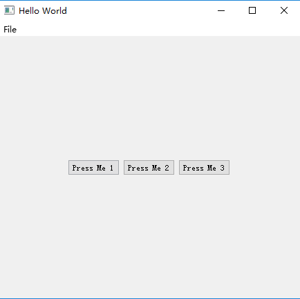

**`QQmlApplicationEngine搭配Window`**
加载以Window为根对象的QML文档，QML文档则拥有窗口的完整控制权，可以直接设置标题、窗口尺寸等属性。**`QQuickView搭配Item`**使用QQuickView显示QML文档，对窗口的控制权（比如设置窗口标题、Icon、窗口的最小尺寸等）在C++代码。

# QQmlApplicationEngine搭配Window启动方式
---
main.c文件
```c++
int main(int argc, char *argv[])
{
    QApplication app(argc, argv);
    QQmlApplicationEngine engine;
    engine.load(QUrl(QStringLiteral("qrc:/main.qml")));
    return app.exec();
}
```
main.qml文件
```qml
ApplicationWindow {
    title: qsTr("Hello World")
    width: 640
    height: 480
    visible: true
    menuBar: MenuBar {
        Menu {
            title: qsTr("&File")
            MenuItem {
                text: qsTr("&Open")
                onTriggered: messageDialog.show(qsTr("Open action triggered"));
            }
            MenuItem {
                text: qsTr("E&xit")
                onTriggered: Qt.quit();
            }
        }
    }
    MainForm {
        anchors.fill: parent
        button1.onClicked: messageDialog.show(qsTr("Button 1 pressed"))
        button2.onClicked: messageDialog.show(qsTr("Button 2 pressed"))
        button3.onClicked: messageDialog.show(qsTr("Button 3 pressed"))
    }
    MessageDialog {
        id: messageDialog
        title: qsTr("May I have your attention, please?")
        function show(caption) {
            messageDialog.text = caption;
            messageDialog.open();
        }
    }
}
```



# QQuickView搭配Item
---
main.c文件
```c++
#include <QApplication>
#include <QQuickView>
#include <QGuiApplication>
#include <QQmlApplicationEngine>
int main(int argc, char *argv[])
{
    QGuiApplication app(argc, argv);
    QQuickView viewer;
    viewer.setResizeMode(QQuickView::SizeRootObjectToView);
    viewer.setSource(QUrl("qrc:///main.qml"));
    viewer.show();
    return app.exec();
}
```
main.qml文件
```qml
import QtQuick 2.4
import QtQuick.Controls 1.3
import QtQuick.Window 2.2
import QtQuick.Dialogs 1.2

Rectangle{
    width: 320;
    height: 240;
}
```

