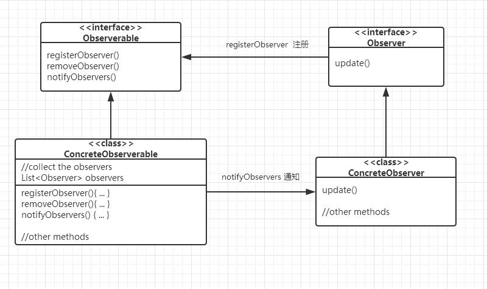

观察者模式是面向对象编程中较为常用的一种设计模式，观察者模式又称为订阅-发布模式，特别是适用于GUI图形界面中，比如Android的View中就大量使用了此模式。

# 观察者模式：
---
> 定义了对象之间的一对多依赖，当一个对象改变状态时，它的所有依赖者都会收到通知并自动更新。

由以上的定义，我们可以知道，观察者模式有两个重要要素：观察者、被观察者。用生活中一个常见的例子来描述：我们通常会订阅天气预报信息，假如天气出现了变化，气象App就会通知我们天气变了要做出相应的准备，那么在这个场景中，我们就充当了“观察者”角色，而气象App则充当了“被观察者”角色，当天气发生了变化，“被观察者”就会通知我们，让我们做出相应改变。

# UML类图
---



我们来分析下上图各个类或者接口的含义：
Observerable：被观察者接口，规定了几个方法，分别是registerObserver():表示将观察者注册到被观察者中，即“订阅”；removeObserver():表示将观察者从被观察者中移除，即“取消订阅”；notifyObservers():当被观察者状态改变的时候，这个方法被调用，通知所有已经注册的观察者。

ConcreteObserverable:被观察者，实现了Observerable接口，对以上的三个方法进行了具体实现，同时有一个List集合，用以保存注册的观察者，等需要通知观察者时，遍历该集合即可。注意，该集合的泛型参数应该是Observer，接口类型，而不应该是具体的Observer实现类，这样做的原因是一个被观察者可能会有多个不同实现类的观察者(但都实现了Observer接口)，如果限定了某一个具体的类型，那么会导致以后要加入新类型的时候而不得不修改当前类，耦合度过高，这是一个非常不好的行为。（设计原则：面向接口编程而不是面向实现编程）

Observer：观察者接口，规定了update()方法，当被观察者调用notifyObservers()方法时，观察者的update()方法会被回调。

ConcreteObserver:观察者，实现了update()方法。

那么了解了以上各部分的含义后，应该不难得出观察者模式的实现过程了。

# 实现步骤
---
我们需要准备Observerable接口，声明注册、移除、通知更新这三个方法，接着需要Observer接口，声明update()方法，然后我们要实现以上两个接口，分别是ConcreteObserverable和ConcreteObserver这两个实现类。其中，ConcreteObserverable应该有一个成员变量用户保存注册的观察者，当需要通知更新的时候，调用ConcreteObserverable#notifyObservers()方法，该方法内部遍历所有的观察者，并调用他们的update()方法，这样便实现了订阅——发布流程。

## Step 1.建立接口
新建Observerable.java文件：
```java
public interface Observerable {
    public void registerObserver(Observer o);
    public void removeObserver(Observer o);
    public void notifyObservers();
}
```
新建Observer.java文件：
```java
public interface Observer {
    public void update(int edition,float cost);
}
```
## Step 2.实现被观察者接口
新建MagazineData.java文件：
```java
public class MagazineData implements Observerable {
    
    private List<Observer> mObservers;
    private int edition;
    private float cost;
    
    public MagazineData() {
        mObservers = new ArrayList<>();
    }
    
    @Override
    public void registerObserver(Observer o) {
        mObservers.add(o);
    }

    @Override
    public void removeObserver(Observer o) {
        int i = mObservers.indexOf(o);
        if(i >= 0)
            mObservers.remove(i);
    }

    @Override
    public void notifyObservers() {
        for(int i = 0; i < mObservers.size(); i++){
            Observer observer = mObservers.get(i);
            observer.update(edition, cost);
        }
    }
    
    public void setInfomation(int edition,float cost){
        this.edition = edition;
        this.cost = cost;
        //信息更新完毕，通知所有观察者
        notifyObservers();
    } 
}
```
## Step 3.实现观察者接口
新建Customer.java文件：
```java
public class Customer implements Observer {
    
    private String name;
    private int edition;
    private float cost;
    
    public Customer(String name){
        this.name = name;
    }
    
    @Override
    public void update(int edition, float cost) {
        this.edition = edition;
        this.cost = cost;
        buy();
    }
    
    public void buy(){
        System.out.println(name+"购买了第"+edition+"期的杂志，花费了"+cost+"元。");
    }
}
```
经过以上三个步骤，已经实现了观察者模式了，那么我们最后再编写一个测试类，来进行测试：
```java
public class Test {

    public static void main(String[] args) {
        //创建被观察者
        MagazineData magazine = new MagazineData();
        //创建三个不同的观察者
        Observer customerA = new Customer("A");
        Observer customerB = new Customer("B");
        Observer customerC = new Customer("C");
        //将观察者注册到被观察者中
        magazine.registerObserver(customerA);
        magazine.registerObserver(customerB);
        magazine.registerObserver(customerC);
        //更新被观察者中的数据，当数据更新后，会自动通知所有已注册的观察者
        magazine.setInfomation(5, 12);
    }
}
```
通过上面的例子，我们可以看出，MagazineData和Customer两者处于松耦合状态，甚至是零耦合状态，如果某一者需求改变了，需要进行代码的修改，这并不会涉及到另一者，这是非常良好的松耦合设计，只需要实现接口即可。

# 认识Java内置的观察者模式
---
其实在Java中，它已经为我们准备了Observerable类以及Observer接口，只要继承或实现，就能快速实现我们的被观察者和观察者了，那么，我们学习下该内置的观察者模式。
首先，我们来看看java.util.Observerable类，这与我们上面自行实现的不同，它是一个类而不是一个接口，因此我们的被观察者要继承该类，另外，Observerable类已经帮我们实现了addObserver()、deleteObserver()、notifyObservers()等方法，因此我们在子类不需要再重写这些方法了，另外，该父类还提供了一个setChanged()方法，该方法用来标记状态已经改变的事实，因此要先调用该方法再调用notifyObservers()方法。其实，该类提供了两个notifyObservers()方法，一个有参数，一个无参数，而有参数的适用于推模型，无参数的适用于拉模型。
而java.util.Observer则是一个接口。

那么，我们来利用Java内置的观察者模式结合拉模型来实现我们上面的小例子。
新建JournalData.java：
```java
public class JournalData extends Observable {
    private int edition;
    private float cost;
    
    public void setInfomation(int edition,float cost){
        this.edition = edition;
        this.cost = cost;
        setChanged();
        //调用无参数的方法，使用拉模型
        notifyObservers();
    }
    
    //提供get方法
    public int getEdition(){
        return edition;
    }
    
    public float getCost(){
        return cost;
    }
}
```
新建Consumer.java:
```java
public class Consumer implements Observer {
    
    private String name;
    private int edition;
    private float cost;
    
    public Consumer(String name){
        this.name = name;
    }
    
    @Override
    public void update(Observable o, Object arg) {
        //判断o是否是JournalData的一个实例
        if(o instanceof JournalData){
            //强制转化为JournalData类型
            JournalData journalData = (JournalData) o;
            //拉取数据
            this.edition = journalData.getEdition();
            this.cost = journalData.getCost();
            buy();
        }

    }
    
    public void buy(){
        System.out.println(name+"购买了第"+edition+"期的杂志，花费了"+cost+"元。");
    }
}
```
测试类Test.java:
```java
public static void main(String[] args) {
        
        //创建被观察者
        JournalData journal = new JournalData();
        //创建三个不同的观察者
        Consumer consumerA = new Consumer("A");
        Consumer consumerB = new Consumer("B");
        Consumer consumerC = new Consumer("C");
        //将观察者注册到被观察者中
        journal.addObserver(consumerA);
        journal.addObserver(consumerB);
        journal.addObserver(consumerC);
        //更新被观察者中的数据
        journal.setInfomation(6, 11);
    }
}
```

# 认识推模型和拉模型
---
推模型：被观察者主动向观察者推送自身的信息，可以是全部信息或者是部分信息。

拉模型：被观察者通过把自身的引用传递给观察者，需要观察者自行通过该引用来获取相关的信息。

比较：推模型适用于提前知道观察者所需要的数据的情况，而拉模型由于把自身传递了过去，因此适用于大多数场景。

